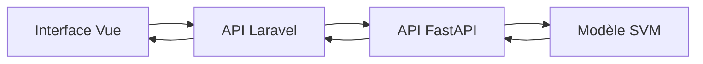

# Accessibilité de l’intégration IA — ReviewPro

## 1. Objectif

L’interface Vue de ReviewPro permet à un utilisateur de saisir un avis, de demander une classification et de consulter le résultat produit par le service d’intelligence artificielle.

Cette fonctionnalité a été améliorée afin de prendre en compte les principes WCAG et RGAA applicables aux formulaires, à la navigation au clavier, aux messages dynamiques, aux contrastes et à la compréhension de l’information.

Le périmètre contrôlé concerne principalement le composant :

```text
src/components/AiAnalyzer.vue
```

## 2. Architecture de l’intégration



L’utilisateur ne contacte pas directement FastAPI. Vue envoie le texte à Laravel, qui utilise le connecteur `AiReviewClassifier` pour appeler le service IA.

## 3. Structure sémantique

La fonctionnalité utilise :

- une section nommée avec `aria-labelledby` ;
- un titre de niveau 2 ;
- un formulaire soumis par un bouton de type `submit` ;
- un élément `label` associé au champ par `for` et `id` ;
- un texte d’aide relié avec `aria-describedby` ;
- un compteur de caractères ;
- une région nommée pour le résultat ;
- un élément `details` et `summary` pour le classement ;
- une liste ordonnée correspondant à l’ordre des catégories.

La langue générale du document a été corrigée :

```html
<html lang="fr">
```

Le titre de la page a également été rendu explicite :

```text
ReviewPro — Analyse des plaintes clients
```

## 4. Accessibilité du champ

Le champ possède désormais :

- un libellé visible « Avis à analyser » ;
- une aide précisant la longueur autorisée ;
- les attributs `required`, `minlength` et `maxlength` ;
- un compteur allant jusqu’à 5 000 caractères ;
- l’attribut `aria-invalid` en cas d’erreur ;
- un nom technique stable pour l’envoi du formulaire.

Le placeholder reste un exemple et ne remplace pas le libellé.

## 5. Messages dynamiques

Pendant l’analyse, le composant :

- désactive temporairement le bouton ;
- remplace son texte par « Analyse en cours… » ;
- applique `aria-busy` à la section ;
- expose un message dans une zone `role="status"` avec `aria-live="polite"`.

En cas d’erreur :

- un message textuel explicite est affiché ;
- le message utilise `role="alert"` ;
- le focus est déplacé vers l’erreur.

Après une prédiction :

- le résultat utilise une région nommée ;
- la région possède `aria-live="polite"` ;
- le focus est déplacé vers le résultat.

## 6. Navigation au clavier et focus

Les éléments interactifs utilisent l’ordre naturel du document :

1. champ de saisie ;
2. bouton d’analyse ;
3. résumé du classement.

Un contour bleu de trois pixels est défini pour :

- le champ ;
- le bouton ;
- le résumé ;
- le message d’erreur focalisé ;
- la région de résultat focalisée.

La capture du test réel montre le contour de focus autour du résultat après la prédiction.

## 7. Couleurs et compréhension

Les couleurs verte et orange distinguent les prédictions exploitables et incertaines. Elles ne constituent cependant pas le seul moyen de transmettre l’information.

Le composant affiche également :

```text
Prédiction exploitable
```

ou :

```text
Vérification humaine nécessaire
```

Les émojis décoratifs sont placés dans un élément possédant `aria-hidden="true"`. Le texte adjacent reste suffisant pour comprendre le statut.

Les couleurs principales ont été renforcées :

- texte sombre sur fonds clairs ;
- bouton bleu foncé avec texte blanc ;
- bouton désactivé gris foncé avec texte blanc ;
- bordures renforcées pour les états fiables et incertains ;
- erreur rouge foncé sur fond rouge clair.

## 8. Tests automatisés

Les outils utilisés sont :

| Outil | Rôle |
|---|---|
| Vitest | Exécution des tests du composant |
| Vue Test Utils | Montage et interaction avec le composant Vue |
| jsdom | Simulation du navigateur |
| axe-core | Détection automatique de violations d’accessibilité |

Le fichier de test est :

```text
tests_frontend/AiAnalyzer.spec.js
```

Quatre comportements sont contrôlés :

1. présence du libellé et de l’aide associée ;
2. annonce et focus de l’erreur ;
3. annonce et focus du résultat ;
4. absence de violation détectée par axe-core.

Résultat obtenu :

```text
Test Files  1 passed (1)
Tests       4 passed (4)
Duration    566 ms
```

L’avertissement relatif à `HTMLCanvasElement.getContext()` provient de jsdom et de l’absence du paquet optionnel `canvas`. Il n’a provoqué aucun échec et ne correspond pas à une violation détectée dans le composant.

## 9. Build de production

La compilation Vite a été exécutée après les corrections :

```text
70 modules transformed
dist/index.html                  0.56 kB
dist/assets/index-vvusgiqx.css  4.61 kB
dist/assets/index-BBgXvZCL.js   115.79 kB
built in 259 ms
```

Aucune vulnérabilité npm n’a été détectée lors de l’installation des outils :

```text
found 0 vulnerabilities
```

## 10. Test d’intégration réel

Les trois services ont été exécutés simultanément :

| Composant | Adresse | Résultat |
|---|---|---|
| Vue | `http://127.0.0.1:5173` | Interface affichée |
| Laravel | `http://127.0.0.1:8000` | HTTP 200 |
| FastAPI | `http://127.0.0.1:8001` | HTTP 200 |

Texte analysé :

```text
The charging port is broken and the battery will not charge.
```

Résultat observé :

| Élément | Valeur |
|---|---|
| Catégorie | `device_hardware` |
| Libellé | Matériel, batterie, écran ou audio |
| Marge | 1,544 |
| Statut | Prédiction exploitable |
| Classement | Cinq catégories affichées dans l’ordre |
| Focus | Visible autour de la région de résultat |

Le tableau de bord a également chargé les 16 200 avis, ce qui confirme la communication entre Vue et Laravel.

## 11. Correspondance avec WCAG et RGAA

| Principe | Application dans ReviewPro |
|---|---|
| Perceptible | Libellés visibles, contrastes renforcés, statut textuel |
| Utilisable | Navigation native, focus visible, contrôle `details` accessible |
| Compréhensible | Aide, validation explicite, compteur, intitulés cohérents |
| Robuste | HTML sémantique, ARIA limitée aux besoins dynamiques, tests axe-core |

Les améliorations concernent notamment les familles de critères relatives :

- aux couleurs ;
- aux éléments de formulaire ;
- à la navigation ;
- à la consultation ;
- à la structuration de l’information ;
- aux scripts et changements de contexte.

## 12. Limites de l’évaluation

Un audit axe-core ne couvre pas tous les critères WCAG ou RGAA. Il doit être complété par des contrôles humains.

Les éléments suivants restent recommandés avant une production publique :

- test complet avec VoiceOver ;
- test avec plusieurs navigateurs ;
- vérification formelle à 200 % et à 400 % ;
- audit de toutes les autres pages du tableau de bord ;
- contrôle des contrastes avec un outil dédié ;
- test auprès d’utilisateurs en situation de handicap.

Les captures fournies démontrent l’affichage réel du formulaire, du résultat, du classement et du focus. Elles ne remplacent pas un audit RGAA complet de toute l’application.

## 13. Correspondance avec la compétence RNCP

Cette réalisation démontre :

- l’intégration d’une API de modèle dans une application Vue et Laravel ;
- le respect d’un contrat REST documenté ;
- la validation des entrées ;
- la gestion des erreurs et des états de chargement ;
- l’utilisation d’une structure HTML sémantique ;
- l’association accessible du champ et de son libellé ;
- la gestion des messages dynamiques et du focus ;
- la transmission de l’information autrement que par la couleur ;
- la programmation de tests automatisés d’accessibilité ;
- la réalisation et la conservation de preuves d’intégration.

## 14. Conclusion

L’API du modèle ReviewPro est intégrée dans l’application existante par l’intermédiaire de Laravel. L’interface permet de saisir un avis, de lancer l’analyse et de consulter la catégorie, la marge, le statut et le classement.

Les principales barrières du composant ont été corrigées et quatre tests automatisés sont réussis, dont un audit axe-core sans violation détectée. Le composant fournit ainsi une preuve concrète d’intégration accessible, tout en déclarant clairement les contrôles humains complémentaires nécessaires avant une mise en production publique.
