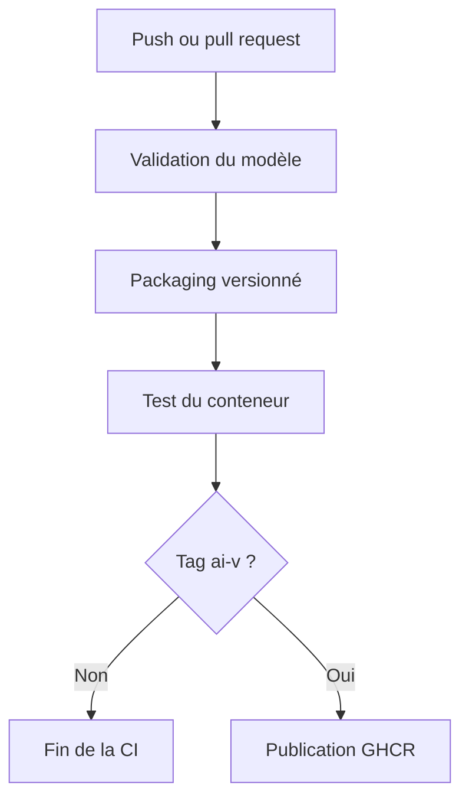

# Chaîne de livraison continue du modèle — ReviewPro

## 1. Objectif

La chaîne de livraison continue de ReviewPro automatise la validation, le test, le packaging et la publication du service d’intelligence artificielle.

Elle garantit qu’une nouvelle version du modèle ne peut être publiée que si :

- les données de validation sont conformes ;
- le modèle et ses métadonnées sont cohérents ;
- les seuils de qualité sont respectés ;
- le contrat de l’API est valide ;
- le monitorage fonctionne ;
- l’image Docker démarre et répond au contrôle de santé.

La chaîne est définie dans :

```text
.github/workflows/model-ci-cd.yml
```

## 2. Architecture de la chaîne



La validation et le test du conteneur sont exécutés à chaque push sur `main` et pour chaque pull request visant `main`. La publication est réservée aux tags commençant par `ai-v`.

## 3. Déclencheurs

| Événement | Validation | Test Docker | Publication |
|---|---:|---:|---:|
| Push sur `main` | Oui | Oui | Non |
| Pull request vers `main` | Oui | Oui | Non |
| Déclenchement manuel | Oui | Oui | Non |
| Tag `ai-v*` | Oui | Oui | Oui |

Ce fonctionnement sépare l’intégration continue de la livraison d’une version officielle.

## 4. Job de validation du modèle

Le job `validate-model` effectue les opérations suivantes :

1. récupération des sources ;
2. installation de Python 3.9 ;
3. mise en cache des dépendances pip ;
4. installation des dépendances de test ;
5. vérification syntaxique des fichiers Python ;
6. exécution des tests automatisés ;
7. création du paquet versionné ;
8. conservation des preuves comme artefact GitHub Actions.

Les tests couvrent :

- le dataset annoté ;
- les classes autorisées ;
- la distribution des catégories ;
- l’empreinte SHA-256 du dataset ;
- les métadonnées et le seuil de décision ;
- le comportement déterministe du modèle ;
- les résultats de validation croisée ;
- les seuils d’accuracy et de F1 ;
- les endpoints FastAPI ;
- le monitorage et le feedback humain.

Résultat local de référence :

```text
39 passed in 0.89s
```

Les tests Laravel restent également valides :

```text
8 tests passed — 25 assertions
```

## 5. Règles de qualité automatisées

| Contrôle | Valeur validée |
|---|---:|
| Nombre d’exemples annotés | 120 |
| Nombre de plis de validation croisée | 5 |
| Accuracy | 0,525 |
| F1 macro | 0,33 |
| F1 pondéré | 0,47 |
| Seuil de décision automatique | 0,30 |
| Accuracy estimée au-dessus du seuil | 0,71 |
| Couverture automatique estimée | 51,7 % |

Les estimations reposent sur un petit jeu de données et ne doivent pas être interprétées comme une garantie de performance en production.

## 6. Packaging du modèle

Le script suivant crée un paquet autonome :

```text
scripts/package_ai_model.py
```

Le paquet contient :

- le modèle Joblib ;
- les métadonnées ;
- le service FastAPI ;
- le module de monitorage ;
- les dépendances d’exécution ;
- un manifeste JSON.

Le paquet local généré est :

```text
dist/reviewpro-ai-model.tar.gz
```

Sa taille observée est de 312 Ko et son empreinte est :

```text
3283f64ea0a32da9bc8c20f6e98047f0701433f640a87548a1c0a6f1b817bd72
```

Le manifeste contient notamment :

- l’empreinte du dataset d’entraînement ;
- l’empreinte du modèle ;
- l’empreinte des métadonnées ;
- la date d’entraînement ;
- les classes ;
- les métriques de validation ;
- le seuil automatique.

## 7. Conteneurisation

Le fichier `Dockerfile.ai` construit une image du service IA.

Les mesures appliquées sont :

- image de base Python 3.9 légère ;
- dépendances d’exécution séparées des dépendances de développement ;
- contexte Docker limité par `.dockerignore` ;
- exclusion des datasets bruts, environnements virtuels et secrets ;
- exécution avec l’utilisateur non privilégié `reviewpro` ;
- base de monitorage placée dans `/app/data` ;
- endpoint exposé sur le port 8001 ;
- contrôle de santé automatique sur `/health`.

## 8. Test automatique du conteneur

Le job `test-container` :

1. construit l’image ;
2. charge l’image dans l’agent GitHub ;
3. démarre un conteneur temporaire ;
4. publie le port 8001 ;
5. interroge `/health` pendant au maximum 40 secondes ;
6. affiche les journaux en cas d’échec ;
7. supprime toujours le conteneur temporaire.

Ce test vérifie que le paquet n’est pas seulement syntaxiquement valide, mais réellement exécutable dans un environnement isolé.

## 9. Artefacts de validation

Le job `validate-model` conserve pendant 30 jours :

- le résultat des tests Pytest ;
- le rapport de couverture ;
- l’archive du modèle ;
- le manifeste du paquet.

L’artefact GitHub Actions porte le nom :

```text
reviewpro-ai-validation
```

Ces fichiers constituent des preuves reproductibles associées à chaque exécution.

## 10. Publication continue

La publication utilise GitHub Container Registry.

Elle est exécutée uniquement si :

- la référence Git est un tag commençant par `ai-v` ;
- le job de validation réussit ;
- le conteneur réussit son test de santé.

L’image publiée est :

```text
ghcr.io/thiaba03/reviewpro-ai
```

La première version a reçu deux tags :

```text
latest
ai-v1.0.0
```

## 11. Versions des outils de CI

Les actions sont référencées avec des versions exactes :

| Action | Version |
|---|---|
| `actions/checkout` | `v7.0.1` |
| `actions/setup-python` | `v7.0.0` |
| `actions/upload-artifact` | `v7.0.1` |
| `docker/setup-buildx-action` | `v4.3.0` |
| `docker/build-push-action` | `v7.3.0` |
| `docker/login-action` | `v4.6.0` |
| `docker/metadata-action` | `v6.2.0` |

Cette mise à jour a supprimé les avertissements liés à la dépréciation de Node.js 20.

## 12. Résultats des exécutions réelles

### 12.1 Première validation

| Élément | Valeur |
|---|---|
| Workflow | `Model CI CD` |
| Exécution | `32605058266` |
| Branche | `main` |
| `validate-model` | Réussi en 35 s |
| `test-container` | Réussi en 57 s |
| `publish-image` | Ignoré, absence de tag |

Cette exécution a révélé un avertissement de dépréciation de Node.js 20. Les versions des actions ont ensuite été mises à jour.

### 12.2 Validation sans avertissement

| Élément | Valeur |
|---|---|
| Exécution | `32605309562` |
| Branche | `main` |
| `validate-model` | Réussi en 40 s |
| `test-container` | Réussi en 55 s |
| Avertissements | Aucun |

### 12.3 Livraison de la version 1.0.0

| Élément | Valeur |
|---|---|
| Tag Git | `ai-v1.0.0` |
| Exécution | `32605554570` |
| `validate-model` | Réussi en 33 s |
| `test-container` | Réussi en 59 s |
| `publish-image` | Réussi en 53 s |
| Version du package GHCR | `1161333805` |
| Date de publication UTC | `2026-08-22T23:36:13Z` |
| Tags Docker | `latest`, `ai-v1.0.0` |

Le résultat démontre que la livraison complète fonctionne réellement et ne repose pas uniquement sur une configuration théorique.

## 13. Sécurité de la chaîne

Les mesures suivantes sont appliquées :

- dépôt GitHub privé pendant la préparation ;
- utilisation de `GITHUB_TOKEN` fourni temporairement par GitHub Actions ;
- permission `contents: read` par défaut ;
- permission `packages: write` limitée au job de publication ;
- absence de clé enregistrée dans le workflow ;
- exclusion de `.env`, des bases SQLite et des environnements virtuels ;
- exclusion des datasets bruts et des sauvegardes ;
- image exécutée sans privilèges administrateur ;
- publication impossible si un job précédent échoue.

Le contrôle effectué avant le premier commit a également exclu les clés Google et les jetons correspondant aux formats recherchés.

## 14. Versionnement

Le schéma de version retenu est :

```text
ai-vMAJEUR.MINEUR.CORRECTIF
```

Exemples :

- `ai-v1.0.1` : correction sans changement fonctionnel majeur ;
- `ai-v1.1.0` : amélioration compatible ou nouveau dataset ;
- `ai-v2.0.0` : modification incompatible du contrat, des catégories ou du modèle.

Chaque nouvelle version doit être accompagnée de nouvelles métadonnées et des métriques de validation correspondantes.

## 15. Procédure de livraison

1. modifier le dataset, le modèle ou le service sur une branche ;
2. lancer les tests localement ;
3. créer une pull request ;
4. attendre la réussite de la CI ;
5. relire les métriques et les changements ;
6. fusionner dans `main` ;
7. vérifier la CI de `main` ;
8. créer un tag `ai-vX.Y.Z` ;
9. pousser le tag ;
10. vérifier les trois jobs et les tags GHCR.

## 16. Retour arrière

Le tag `latest` désigne la version la plus récente, mais la production doit pouvoir utiliser un tag immuable, par exemple :

```text
ghcr.io/thiaba03/reviewpro-ai:ai-v1.0.0
```

En cas d’incident sur une nouvelle version :

1. identifier la dernière version stable ;
2. redéployer son tag versionné ;
3. vérifier `/health` et les métriques ;
4. documenter l’incident ;
5. corriger sur une branche ;
6. publier une nouvelle version après validation.

Cette stratégie évite de dépendre exclusivement du tag mobile `latest`.

## 17. Limites et améliorations

La chaîne actuelle publie une image prête à être déployée, mais elle ne déploie pas encore automatiquement vers un serveur de production.

Les améliorations possibles sont :

- ajouter un environnement GitHub protégé avec validation manuelle ;
- déployer sur une infrastructure de recette ;
- signer les images et générer une nomenclature logicielle SBOM ;
- analyser les vulnérabilités du conteneur ;
- épingler les actions par empreinte de commit ;
- ajouter une stratégie multi-architecture `amd64` et `arm64` ;
- déployer Prometheus et Grafana ;
- automatiser un test après déploiement ;
- automatiser le retour arrière en cas d’échec du contrôle de santé.

## 18. Correspondance avec la compétence RNCP

Cette réalisation démontre :

- l’installation et le paramétrage d’un outil d’intégration continue ;
- la validation automatique des données, du modèle et de l’API ;
- le contrôle automatique des métriques minimales ;
- le packaging reproductible du modèle ;
- la conteneurisation du service ;
- le test automatique du conteneur ;
- la conservation des preuves de validation ;
- le versionnement du modèle et de l’image ;
- la publication automatique vers un registre ;
- la séparation des permissions et la protection des secrets ;
- la définition d’une procédure de livraison et de retour arrière ;
- l’application concrète d’une démarche MLOps.

## 19. Conclusion

ReviewPro dispose désormais d’une chaîne MLOps fonctionnelle et vérifiée sur GitHub Actions. Chaque modification du modèle est contrôlée automatiquement, et une image n’est publiée que lorsque les validations et le test d’exécution réussissent.

La version `ai-v1.0.0` a été construite, testée et publiée dans GitHub Container Registry. Les identifiants d’exécution, les durées, les artefacts, les empreintes et les tags constituent les preuves de la livraison continue réalisée.
