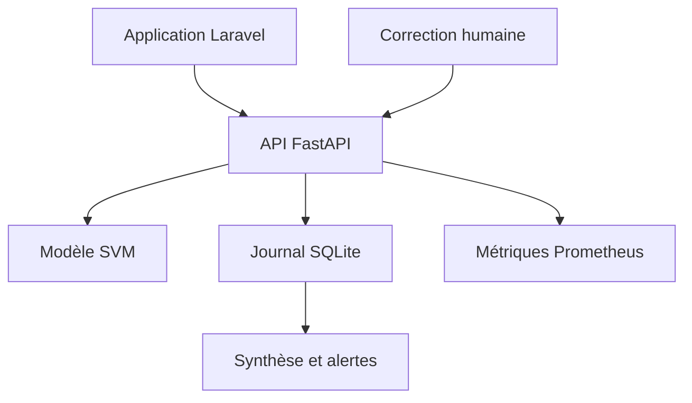

# Monitorage du modèle d’intelligence artificielle — ReviewPro

## 1. Objectif

Le service d’intelligence artificielle de ReviewPro classe la plainte principale exprimée dans un avis client. Le monitorage permet de vérifier son fonctionnement technique et la qualité de ses décisions après sa mise en service.

Il répond à quatre objectifs :

- détecter rapidement une indisponibilité ou une hausse des erreurs ;
- mesurer le temps de réponse et le niveau de confiance du modèle ;
- repérer les prédictions nécessitant une vérification humaine ;
- collecter les corrections humaines afin d’alimenter une boucle d’amélioration.

## 2. Périmètre surveillé

Le dispositif surveille le modèle `review_topic_macro_svm`, exposé par une API FastAPI.

Le modèle utilise une représentation TF-IDF des mots et des caractères ainsi qu’un classifieur LinearSVC. Il produit l’une des cinq catégories suivantes :

| Catégorie technique | Libellé métier |
|---|---|
| `commercial_service` | Prix, garantie, service ou livraison |
| `device_hardware` | Matériel, batterie, écran ou audio |
| `other_unclear` | Avis imprécis ou hors cible |
| `software_ecosystem` | Logiciel, connexion ou compatibilité |
| `usability` | Utilisation et configuration |

Le seuil de décision automatique est fixé à `0,30`. Une marge inférieure à ce seuil déclenche une vérification humaine.

## 3. Architecture du monitorage



Le fichier `ai_service/monitoring.py` centralise la collecte des métriques et la journalisation. Le fichier `ai_service/main.py` expose les endpoints nécessaires.

## 4. Endpoints de supervision

| Méthode | Endpoint | Rôle |
|---|---|---|
| `GET` | `/health` | Vérifier la disponibilité et la version du modèle |
| `POST` | `/predict` | Produire et journaliser une prédiction |
| `POST` | `/feedback` | Enregistrer une correction humaine |
| `GET` | `/monitoring/summary` | Restituer les indicateurs sur une période |
| `GET` | `/monitoring/alerts` | Restituer les incidents détectés |
| `GET` | `/metrics` | Exposer les métriques au format Prometheus |

Les périodes de synthèse sont comprises entre 1 et 720 heures. Une valeur hors de cet intervalle est rejetée par l’API.

## 5. Journalisation des prédictions

Les événements sont enregistrés dans une base SQLite séparée :

```text
storage/app/ai/monitoring.sqlite
```

La table `prediction_logs` conserve notamment :

- la date et l’heure UTC ;
- le hash du texte ;
- le nom et la version du modèle ;
- la catégorie prédite ;
- le score de décision ;
- la marge entre les deux meilleures catégories ;
- le seuil appliqué ;
- le besoin de vérification humaine ;
- la latence en millisecondes ;
- le statut de la requête ;
- le type d’erreur éventuel.

La table `prediction_feedback` conserve :

- l’identifiant de la prédiction ;
- la catégorie corrigée ;
- l’indication précisant si la prédiction était correcte ;
- la date du retour humain.

## 6. Protection des données

Le texte brut de l’avis n’est pas conservé dans la base de monitorage. Le service calcule un hash SHA-256 après normalisation du texte.

Cette solution permet :

- de limiter les données enregistrées ;
- de détecter le traitement répété d’un même contenu ;
- de rattacher les métriques à une exécution sans stocker l’avis ;
- de réduire le risque d’exposition de données personnelles.

Le hash ne doit cependant pas être présenté comme une anonymisation absolue. Les textes courts ou prévisibles peuvent faire l’objet d’attaques par dictionnaire. L’accès à la base doit donc rester protégé.

## 7. Métriques Prometheus

Le endpoint `/metrics` expose notamment :

| Métrique | Utilité |
|---|---|
| `reviewpro_ai_predictions_total` | Nombre de prédictions par catégorie, statut et besoin de vérification |
| `reviewpro_ai_prediction_errors_total` | Nombre d’erreurs par type |
| `reviewpro_ai_prediction_latency_seconds` | Distribution des temps de réponse |
| `reviewpro_ai_prediction_margin` | Distribution des marges de décision |
| `reviewpro_ai_feedback_total` | Nombre de retours humains corrects ou incorrects |

Ces métriques sont adaptées à une collecte future par Prometheus et à une restitution dans Grafana.

## 8. Indicateurs métier

Le endpoint `/monitoring/summary` calcule :

- le nombre total de requêtes ;
- le nombre de succès et d’erreurs ;
- le taux d’erreur ;
- le nombre et le taux de vérifications humaines ;
- la marge moyenne ;
- la latence moyenne ;
- le nombre de feedbacks ;
- l’exactitude observée à partir des feedbacks ;
- la répartition des catégories prédites.

La marge de décision est la différence entre les scores des deux catégories les mieux classées. Une marge faible signifie que le modèle hésite entre plusieurs catégories.

## 9. Règles d’alerte

| Code | Condition | Niveau |
|---|---|---|
| `high_error_rate` | Plus de 5 % d’erreurs après au moins 5 requêtes | Critique |
| `high_manual_review_rate` | Plus de 60 % de vérifications après au moins 5 succès | Avertissement |
| `high_latency` | Latence moyenne supérieure à 500 ms après au moins 5 requêtes | Avertissement |
| `low_feedback_accuracy` | Exactitude inférieure à 60 % après au moins 5 feedbacks | Critique |

Le volume minimal évite de déclencher une alerte à partir d’une seule observation.

## 10. Feedback loop

Chaque réponse de `/predict` contient un `prediction_id`. Une correction humaine peut ensuite être envoyée à `/feedback` avec cet identifiant et la catégorie attendue.

Exemple :

```json
{
  "prediction_id": 10,
  "corrected_category": "device_hardware"
}
```

La correction permet de calculer une exactitude observée en production. À terme, les exemples vérifiés pourront être examinés, validés puis ajoutés au dataset d’entraînement dans le cadre d’un nouveau cycle de versionnement.

Un feedback ne déclenche pas automatiquement un réentraînement. Une validation humaine reste nécessaire afin d’éviter d’introduire des données incorrectes ou malveillantes.

## 11. Résultats du test réel

Le 23 août 2026, une prédiction a été exécutée avec la plainte suivante :

```text
The charging port is broken and the battery will not charge.
```

Résultat :

| Indicateur | Valeur |
|---|---:|
| Identifiant | 10 |
| Catégorie | `device_hardware` |
| Score de décision | 0,719638 |
| Marge | 1,544041 |
| Seuil | 0,30 |
| Vérification nécessaire | Non |

Le feedback humain a confirmé la catégorie. La réponse du service était :

```json
{
  "status": "recorded",
  "is_correct": true
}
```

## 12. Synthèse observée

La synthèse sur 24 heures a fourni les valeurs suivantes :

| Indicateur | Valeur |
|---|---:|
| Requêtes | 1 |
| Succès | 1 |
| Erreurs | 0 |
| Taux d’erreur | 0 % |
| Vérifications humaines | 0 |
| Taux de vérification | 0 % |
| Marge moyenne | 1,544 |
| Latence moyenne | 2,76 ms |
| Feedbacks | 1 |
| Exactitude des feedbacks | 100 % |

Le endpoint d’alerte a retourné le statut `ok` et aucune alerte.

## 13. Tests automatisés

La suite Pytest contient 39 tests, dont six tests consacrés au monitorage.

Les contrôles vérifient :

- la journalisation d’une prédiction ;
- l’absence de texte brut dans le schéma ;
- la présence d’un hash de 64 caractères ;
- la restitution de la synthèse ;
- l’enregistrement d’une correction ;
- le rejet d’une catégorie inconnue ;
- le rejet d’un identifiant inexistant ;
- l’exposition des métriques Prometheus ;
- le fonctionnement des alertes ;
- la validation de la période demandée.

Résultat obtenu :

```text
39 passed in 0.83s
```

## 14. Procédure de diagnostic

En cas d’incident :

1. vérifier `/health` ;
2. vérifier le processus écoutant sur le port 8001 ;
3. consulter `/monitoring/summary` ;
4. consulter `/monitoring/alerts` ;
5. examiner les métriques Prometheus ;
6. consulter les journaux Uvicorn ;
7. vérifier l’espace disque et l’accès à `monitoring.sqlite` ;
8. exécuter `python -m pytest -v` avant toute remise en service.

## 15. Limites et améliorations

Le dispositif actuel fonctionne sur une machine locale. Avant une mise en production, il faudra :

- déployer Prometheus et Grafana ;
- envoyer les alertes vers un canal opérationnel ;
- mettre en place une authentification pour les endpoints de supervision et de feedback ;
- appliquer une durée de conservation et une purge automatique ;
- sauvegarder et faire tourner les journaux ;
- suivre la distribution des textes sans conserver leur contenu ;
- comparer les distributions de production et d’entraînement ;
- calculer les métriques de qualité sur un volume plus important de feedbacks ;
- versionner les nouveaux datasets et modèles ;
- documenter les opérations de réentraînement et de retour arrière.

## 16. Correspondance avec la compétence RNCP

Cette réalisation démontre :

- l’identification de métriques techniques et métier ;
- l’intégration d’un outil de collecte compatible Prometheus ;
- la restitution des indicateurs par API ;
- la création de règles d’alerte automatiques ;
- la journalisation structurée des prédictions ;
- la minimisation des données personnelles ;
- la mise en place d’une boucle de feedback humain ;
- la programmation de tests automatisés du monitorage ;
- la définition d’une procédure de diagnostic et d’amélioration itérative.

## 17. Conclusion

ReviewPro dispose maintenant d’un premier dispositif de monitorage reproductible. Il surveille la disponibilité, les erreurs, la latence, la confiance du modèle, les demandes de vérification et les corrections humaines.

Le dispositif fournit les informations nécessaires pour détecter un incident et préparer une amélioration itérative du modèle dans une approche MLOps. Son passage en production nécessitera principalement l’ajout d’une plateforme de visualisation, d’un canal d’alerte, d’une authentification et d’une politique automatisée de conservation.
