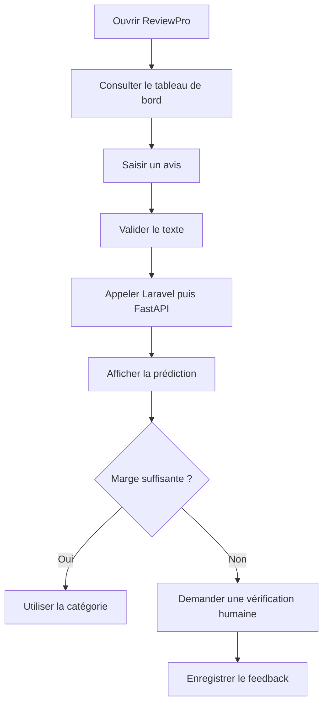

# Analyse du besoin et spécifications fonctionnelles — ReviewPro

## 1. Présentation du projet

ReviewPro est une application web qui centralise et analyse des avis portant sur des produits électroniques.

L’application utilise un service d’intelligence artificielle afin d’identifier automatiquement la principale famille de plainte exprimée dans un avis client.

Les résultats sont ensuite présentés dans un tableau de bord permettant de repérer les produits, les marques et les problèmes qui concentrent le plus de plaintes.

## 2. Présentation du commanditaire

Dans le cadre de cette mise en situation, le commanditaire est fictif.

Il s’agit d’une entreprise commercialisant des produits électroniques et souhaitant améliorer le suivi de la satisfaction de ses clients.

L’entreprise collecte des avis depuis plusieurs sources, mais ne dispose pas d’un outil unique permettant :

- de centraliser les avis ;
- de suivre leur provenance ;
- de consulter leur sentiment ;
- d’identifier leur principale famille de plainte ;
- de repérer les produits recevant le plus de retours négatifs ;
- de produire rapidement des indicateurs d’aide à la décision.

## 3. Problématique

L’analyse manuelle d’un grand nombre d’avis est longue, répétitive et difficile à maintenir.

Les équipes doivent lire individuellement les commentaires pour comprendre les causes d’insatisfaction. Cette méthode devient difficilement applicable lorsque le nombre d’avis augmente.

Le besoin principal peut donc être formulé ainsi :

> Comment automatiser la centralisation et la classification des avis clients afin d’aider une entreprise à identifier rapidement les problèmes les plus fréquemment signalés sur ses produits électroniques ?

## 4. Objectif principal

L’objectif principal de ReviewPro est de fournir une application permettant de collecter, stocker, consulter et analyser des avis clients à l’aide d’un service d’intelligence artificielle.

L’application doit permettre au commanditaire de transformer des textes non structurés en informations exploitables.

## 5. Objectifs secondaires

ReviewPro doit permettre de :

- centraliser les avis issus de plusieurs sources ;
- conserver la provenance des données ;
- rechercher et filtrer les avis ;
- consulter les statistiques principales ;
- analyser le sentiment associé aux avis ;
- classer la plainte principale dans une famille compréhensible ;
- signaler les prédictions incertaines ;
- permettre une vérification humaine ;
- surveiller le fonctionnement du service d’intelligence artificielle ;
- protéger les données personnelles ;
- rendre les principales fonctionnalités accessibles.

## 6. Utilisateurs concernés

### 6.1 Responsable qualité

Le responsable qualité consulte les plaintes les plus fréquentes afin de repérer les défauts ou difficultés signalés par les clients.

### 6.2 Responsable produit

Le responsable produit identifie les produits et les catégories qui concentrent le plus d’avis négatifs afin de prioriser les améliorations.

### 6.3 Équipe du service après-vente

L’équipe du service après-vente utilise les catégories de plaintes pour comprendre plus rapidement les demandes récurrentes.

### 6.4 Administrateur technique

L’administrateur vérifie le fonctionnement de l’application, du backend et du service d’intelligence artificielle.

Il consulte les journaux, les métriques, les alertes et les informations de santé des services.

### 6.5 Utilisateur déposant un avis

L’utilisateur saisit un avis depuis l’interface. Il doit recevoir un retour compréhensible sur la prise en compte ou l’analyse de son texte.

## 7. Périmètre fonctionnel

Le périmètre de la première version comprend :

- un tableau de bord statistique ;
- une liste filtrable et paginée des avis ;
- un formulaire de création d’avis ;
- une fonctionnalité de classification d’une plainte ;
- l’affichage de la catégorie prédite ;
- l’affichage de la marge de décision ;
- le signalement d’une prédiction incertaine ;
- l’affichage du classement complet des catégories ;
- une API REST Laravel ;
- une API REST FastAPI exposant le modèle ;
- un système de monitorage ;
- un mécanisme de feedback humain ;
- des tests automatisés ;
- une chaîne d’intégration et de livraison continues.

## 8. Éléments hors périmètre de la première version

Les éléments suivants ne sont pas considérés comme totalement finalisés dans la première version :

- le déploiement sur une infrastructure de production publique ;
- l’entraînement automatique à partir des nouveaux feedbacks ;
- une authentification complète avec plusieurs rôles ;
- la gestion automatisée de la durée de conservation des données ;
- l’analyse dans un grand nombre de langues ;
- le remplacement total de la décision humaine ;
- une application mobile native.

## 9. Besoins fonctionnels

| Identifiant | Besoin fonctionnel | Priorité |
|---|---|---|
| BF-01 | Consulter les indicateurs principaux du tableau de bord | Haute |
| BF-02 | Consulter une liste paginée des avis | Haute |
| BF-03 | Filtrer les avis par sentiment, marque, produit, note ou source | Haute |
| BF-04 | Rechercher un avis à partir de son contenu | Moyenne |
| BF-05 | Ajouter manuellement un nouvel avis | Haute |
| BF-06 | Envoyer un texte au service d’intelligence artificielle | Haute |
| BF-07 | Afficher la catégorie de plainte prédite | Haute |
| BF-08 | Afficher la marge et le seuil de décision | Haute |
| BF-09 | Signaler les prédictions nécessitant une vérification humaine | Haute |
| BF-10 | Afficher le classement complet des catégories | Moyenne |
| BF-11 | Enregistrer une correction humaine | Haute |
| BF-12 | Consulter la santé et les métriques du service | Haute |
| BF-13 | Détecter automatiquement certaines situations anormales | Haute |
| BF-14 | Exposer les données et les analyses par des API REST | Haute |

## 10. Exigences non fonctionnelles

### 10.1 Performance

- l’interface doit rester utilisable pendant les appels réseau ;
- une indication de chargement doit être affichée pendant une analyse ;
- la liste des avis doit être paginée ;
- les requêtes ne doivent pas retourner plus de 100 avis par page ;
- le délai de réponse du service d’intelligence artificielle doit être mesuré.

### 10.2 Disponibilité et résilience

- le service d’intelligence artificielle doit exposer une route de santé ;
- Laravel doit retourner une erreur compréhensible lorsque FastAPI est indisponible ;
- les erreurs techniques ne doivent pas afficher d’information sensible à l’utilisateur ;
- les incidents doivent être enregistrés dans des journaux techniques.

### 10.3 Maintenabilité

- Vue, Laravel et FastAPI doivent être séparés ;
- les paramètres variables doivent être placés dans les fichiers d’environnement ;
- les dépendances doivent être décrites dans des fichiers de configuration ;
- les tests doivent pouvoir être exécutés automatiquement ;
- le modèle et ses métadonnées doivent être versionnés.

### 10.4 Compatibilité

- l’interface doit fonctionner sur les navigateurs récents ;
- l’affichage doit rester lisible sur différentes tailles d’écran ;
- les échanges entre composants doivent utiliser le format JSON ;
- les API doivent respecter les principes de l’architecture REST.

## 11. Utilisabilité et accessibilité

Les principales fonctionnalités doivent pouvoir être utilisées au clavier et comprises sans dépendre uniquement de la couleur.

Les exigences retenues sont les suivantes :

- associer un libellé explicite à chaque champ de formulaire ;
- fournir une aide indiquant la longueur attendue du texte ;
- afficher un focus visible ;
- annoncer les erreurs de validation ;
- annoncer le résultat d’une prédiction ;
- déplacer le focus vers le message important lorsque cela est nécessaire ;
- indiquer l’état de chargement ;
- fournir un texte en complément des couleurs et des icônes ;
- utiliser un contraste suffisant ;
- conserver une structure de titres cohérente ;
- définir la langue principale de la page en français.

Ces règles sont contrôlées par des tests Vue et axe-core. Elles ne remplacent pas un audit RGAA complet avec plusieurs technologies d’assistance.

## 12. Sécurité et protection des données

Les principes retenus sont :

- valider les données reçues par Laravel et FastAPI ;
- limiter la longueur des textes analysés ;
- ne pas placer de secret dans le code source ;
- utiliser des variables d’environnement pour les clés et les URL ;
- ne pas enregistrer le texte brut dans les journaux de monitorage ;
- enregistrer uniquement une empreinte SHA-256 lorsque cela est suffisant ;
- anonymiser les auteurs importés lorsqu’ils ne sont pas nécessaires ;
- limiter les informations retournées par les API ;
- prévoir une authentification pour les routes sensibles avant la production ;
- documenter la provenance, la licence et les conditions d’utilisation des données.

## 13. Histoires utilisateurs

### US-01 — Consulter le tableau de bord

En tant que responsable qualité, je souhaite consulter les indicateurs principaux afin de connaître rapidement la situation générale des avis.

### US-02 — Filtrer les avis

En tant que responsable produit, je souhaite filtrer les avis par sentiment et par marque afin d’identifier les produits qui concentrent les plaintes.

### US-03 — Analyser un avis

En tant qu’utilisateur, je souhaite saisir un avis afin d’obtenir sa principale famille de plainte.

### US-04 — Identifier une prédiction incertaine

En tant que responsable qualité, je souhaite savoir lorsqu’une prédiction est incertaine afin de ne pas prendre une décision automatique non fiable.

### US-05 — Corriger une prédiction

En tant que personne chargée de la vérification, je souhaite enregistrer la catégorie correcte afin d’alimenter la boucle de feedback.

### US-06 — Surveiller le service

En tant qu’administrateur technique, je souhaite consulter les erreurs, la latence, le taux de vérification et les alertes afin de détecter un incident.

## 14. Critères d’acceptation principaux

### CA-01 — Tableau de bord

Étant donné que l’API Laravel et la base de données sont disponibles, lorsque l’utilisateur ouvre le tableau de bord, alors les indicateurs calculés à partir de la base sont affichés.

### CA-02 — Validation d’un texte

Étant donné que le texte contient moins de trois caractères, lorsque l’utilisateur demande une analyse, alors aucun appel d’analyse n’est effectué et un message compréhensible est annoncé.

### CA-03 — Prédiction exploitable

Étant donné que la marge est supérieure ou égale au seuil, lorsque le service retourne sa réponse, alors la catégorie, son libellé, la marge et le statut de prédiction exploitable sont affichés.

### CA-04 — Vérification humaine

Étant donné que la marge est inférieure au seuil, lorsque le résultat est affiché, alors l’interface indique qu’une vérification humaine est nécessaire.

### CA-05 — Indisponibilité du service IA

Étant donné que FastAPI est indisponible, lorsque Laravel tente d’obtenir une prédiction, alors Laravel retourne une réponse HTTP 503 avec un message contrôlé.

### CA-06 — Accessibilité

Étant donné qu’un utilisateur utilise uniquement le clavier, lorsqu’il analyse un avis, alors il peut atteindre le champ et le bouton, puis être informé de l’erreur ou du résultat.

### CA-07 — Monitorage

Étant donné qu’une prédiction est exécutée, lorsque l’administrateur consulte les métriques, alors le compteur, la latence, la catégorie et le statut de vérification sont pris en compte sans exposer le texte brut.

## 15. Parcours principal de l’utilisateur

## 16. Faisabilité technique

La faisabilité a été confirmée par un prototype fonctionnel composé de :

- Vue pour l’interface utilisateur ;
- Axios pour les échanges HTTP ;
- Laravel pour l’API applicative et l’accès aux données ;
- SQLite pour le développement et les tests locaux ;
- FastAPI pour exposer le modèle ;
- scikit-learn et Joblib pour la classification ;
- Prometheus Client pour les métriques ;
- Pytest, PHPUnit, Vitest et axe-core pour les tests ;
- GitHub Actions pour l’intégration et la livraison continues ;
- Docker pour le packaging du service d’intelligence artificielle.

Les principaux composants ont été exécutés et testés localement. Le modèle fonctionne sur un ordinateur standard et ne nécessite pas de processeur graphique pour réaliser une prédiction.

## 17. Contraintes et risques

| Risque ou contrainte | Conséquence possible | Réponse prévue |
|---|---|---|
| Petit jeu annoté de 120 avis | Performance limitée du modèle | Feedback humain et enrichissement progressif |
| Déséquilibre entre les catégories | Mauvaise reconnaissance des classes rares | Mesurer le F1 macro et rééquilibrer le dataset |
| Indisponibilité de FastAPI | Fonction IA inutilisable | Timeout, erreur 503 et monitorage |
| Données personnelles dans les avis | Risque réglementaire | Minimisation, anonymisation et limitation des journaux |
| Dépendance entre trois composants | Diagnostic plus complexe | Routes de santé et journaux séparés |
| Interface non accessible | Exclusion de certains utilisateurs | Tests automatisés et vérifications manuelles |
| Absence d’authentification complète | Accès non maîtrisé aux routes sensibles | À finaliser avant la production |

## 18. Indicateurs de réussite

Le projet est considéré comme fonctionnel lorsque :

- les trois composants peuvent communiquer ;
- le tableau de bord affiche des données provenant de la base ;
- un avis valide peut être analysé ;
- une prédiction incertaine est signalée ;
- une indisponibilité du service est gérée ;
- les tests automatisés sont réussis ;
- les métriques et alertes sont consultables ;
- une version livrable peut être produite automatiquement.

## 19. Correspondance avec la compétence

Cette analyse démontre :

- l’identification du besoin du commanditaire ;
- la définition des objectifs de développement ;
- la rédaction des spécifications fonctionnelles et non fonctionnelles ;
- l’identification des utilisateurs et de leurs parcours ;
- la définition de critères d’acceptation vérifiables ;
- la prise en compte de l’utilisabilité et de l’accessibilité ;
- la prise en compte de la sécurité et de la gestion des données ;
- l’analyse des contraintes, des risques et de la faisabilité technique.

## 20. Conclusion

ReviewPro répond à un besoin d’aide à l’analyse des avis clients. Le projet ne cherche pas à remplacer entièrement la décision humaine : il automatise une première classification et signale les cas nécessitant une vérification.

Les spécifications définissent un périmètre réalisable, mesurable et compatible avec l’architecture technique existante. Elles serviront de référence pour vérifier la conformité du développement et préparer les tests d’acceptation.
