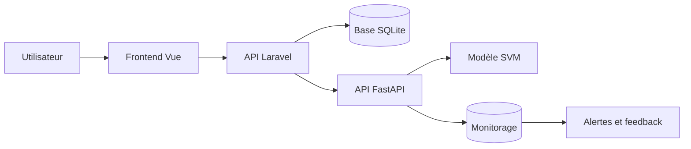
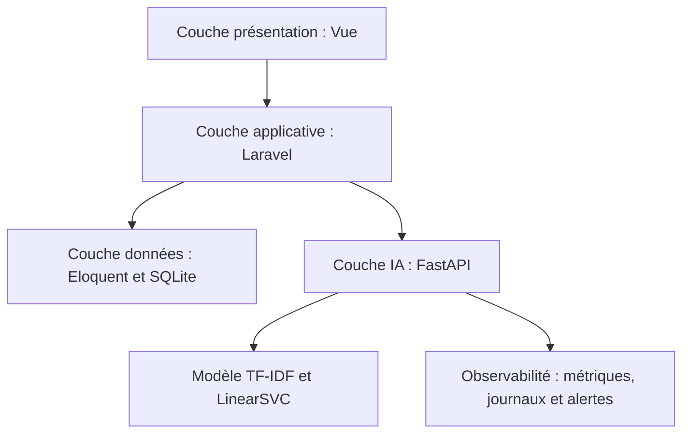
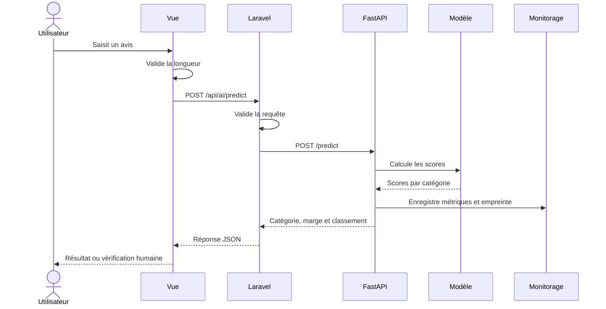
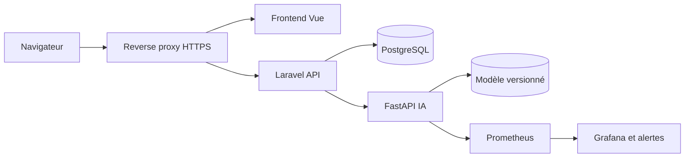

# Architecture technique et applicative — ReviewPro

## 1. Objectif du document

Ce document décrit le cadre technique retenu pour développer et exploiter ReviewPro.

Il présente :

- l’architecture générale ;
- les responsabilités des composants ;
- les flux entre les services ;
- les choix technologiques ;
- les méthodes de développement ;
- les mesures de sécurité ;
- les environnements ;
- les contraintes et les évolutions possibles.

## 2. Principes d’architecture

L’architecture repose sur la séparation des responsabilités.

- Vue gère l’interface et les interactions avec l’utilisateur.
- Laravel gère les règles applicatives, les données et le connecteur vers l’IA.
- FastAPI charge le modèle et expose les fonctions d’intelligence artificielle.
- SQLite stocke les données applicatives pendant le développement.
- Prometheus Client produit les métriques du service d’intelligence artificielle.
- GitHub Actions automatise les contrôles, le packaging et la livraison.

Cette séparation permet de modifier le frontend, le backend ou le modèle sans reconstruire entièrement les autres composants.

## 3. Vue générale du système



## 4. Architecture en couches



## 5. Composants applicatifs

### 5.1 Frontend Vue

Le frontend fournit :

- le tableau de bord ;
- la consultation des avis ;
- le formulaire de création ;
- le formulaire d’analyse IA ;
- l’affichage de la catégorie prédite ;
- l’affichage de la marge et du classement ;
- les messages d’erreur et de chargement ;
- les comportements d’accessibilité.

Technologies principales :

- Vue 3 ;
- Vite ;
- Axios ;
- CSS avec styles limités aux composants ;
- Vitest et Vue Test Utils ;
- axe-core pour les contrôles automatisés d’accessibilité.

### 5.2 Backend Laravel

Laravel constitue le point d’entrée applicatif.

Il assure :

- l’exposition de l’API `/api` ;
- la validation des données ;
- l’accès à la base avec Eloquent ;
- la pagination et le filtrage des avis ;
- les agrégations du tableau de bord ;
- la gestion contrôlée des erreurs ;
- l’appel HTTP au service FastAPI ;
- la transformation de la réponse IA pour le frontend.

### 5.3 Service FastAPI

FastAPI isole les responsabilités liées au modèle.

Le service assure :

- le chargement du modèle Joblib ;
- le chargement des métadonnées ;
- la validation du texte ;
- la prédiction ;
- le calcul du classement et de la marge ;
- l’application du seuil de vérification ;
- l’enregistrement des données de monitorage ;
- l’enregistrement des feedbacks humains ;
- l’exposition des métriques Prometheus.

### 5.4 Modèle d’intelligence artificielle

Le modèle retenu utilise :

- une représentation TF-IDF des mots et caractères ;
- un classificateur LinearSVC ;
- cinq familles de plaintes ;
- un seuil automatique de marge fixé à `0,30` ;
- des métadonnées contenant les métriques et l’empreinte du dataset.

### 5.5 Base de données

SQLite est utilisée dans l’environnement local et dans les tests.

Les principales tables sont :

- `reviews` ;
- `products` ;
- `brands` ;
- `data_sources` ;
- `import_batches` ;
- `product_snapshots` ;
- `commerces` ;
- `users`.

Une base distincte stocke les informations de monitorage du service IA.

## 6. Flux de prédiction



## 7. Contrats des API

### 7.1 Routes Laravel principales

| Méthode | Route | Responsabilité |
|---|---|---|
| GET | `/api/dashboard` | Retourner les statistiques agrégées |
| GET | `/api/reviews` | Retourner une liste paginée et filtrée |
| POST | `/api/reviews` | Créer et analyser un avis |
| GET | `/api/reviews/{review}` | Consulter un avis |
| DELETE | `/api/reviews/{review}` | Supprimer un avis |
| POST | `/api/ai/predict` | Transmettre un texte au service IA |

### 7.2 Routes FastAPI principales

| Méthode | Route | Responsabilité |
|---|---|---|
| GET | `/health` | Vérifier la santé et la version du modèle |
| POST | `/predict` | Classer un texte |
| POST | `/feedback` | Enregistrer une correction humaine |
| GET | `/metrics` | Exposer les métriques Prometheus |
| GET | `/monitoring/summary` | Retourner une synthèse du monitorage |
| GET | `/monitoring/alerts` | Détecter les seuils d’alerte |

## 8. Format d’une prédiction

Une réponse de prédiction contient notamment :

```json
{
  "prediction_id": 10,
  "category": "device_hardware",
  "label": "Matériel, batterie, écran ou audio",
  "decision_score": 0.719638,
  "margin": 1.544041,
  "threshold": 0.3,
  "needs_review": false,
  "ranking": []
}
```

Le frontend utilise `needs_review` pour afficher un message de vérification lorsque la marge est insuffisante.

## 9. Choix des technologies

| Besoin | Outil retenu | Justification |
|---|---|---|
| Interface web | Vue 3 | Composants réactifs et intégration simple |
| Construction frontend | Vite | Démarrage et compilation rapides |
| Appels HTTP frontend | Axios | Gestion simple des requêtes JSON |
| API applicative | Laravel | Validation, Eloquent, migrations et tests |
| API du modèle | FastAPI | Validation Pydantic et documentation OpenAPI |
| Modèle NLP | scikit-learn | Solution légère, reproductible et suffisante pour la V1 |
| Persistance du modèle | Joblib | Compatible avec le pipeline scikit-learn |
| Base locale | SQLite | Installation minimale et tests rapides |
| Tests backend | PHPUnit | Intégration native avec Laravel |
| Tests IA | Pytest | Adapté aux données, au modèle et à FastAPI |
| Tests frontend | Vitest | Compatible avec Vue et Vite |
| Accessibilité | axe-core | Détection automatisée de violations courantes |
| Métriques | Prometheus Client | Format standard d’observabilité |
| Packaging | Docker | Environnement reproductible |
| Automatisation | GitHub Actions | CI/CD intégrée aux dépôts GitHub |

## 10. Choix de méthode de développement

Les méthodes recommandées sont :

- versionner le code avec Git ;
- travailler à partir d’un backlog priorisé ;
- découper le développement en petites fonctionnalités testables ;
- utiliser des branches courtes pour les modifications importantes ;
- effectuer une revue avant intégration lorsque plusieurs personnes participent ;
- associer chaque fonctionnalité à des critères d’acceptation ;
- automatiser les tests dans la CI ;
- versionner les releases avec des tags ;
- conserver les décisions techniques importantes dans la documentation.

## 11. Configuration

Les paramètres variables sont externalisés.

Exemples :

```dotenv
AI_SERVICE_URL=http://127.0.0.1:8001
AI_SERVICE_TIMEOUT=10
```

Les fichiers `.env` ne doivent pas être versionnés. Le fichier `.env.example` décrit uniquement les variables attendues et ne doit contenir aucun secret réel.

## 12. Gestion des erreurs

| Situation | Comportement attendu |
|---|---|
| Texte manquant | Erreur de validation 422 |
| Texte trop court ou trop long | Refus avec information compréhensible |
| FastAPI indisponible | Réponse Laravel 503 |
| Timeout | Erreur contrôlée et journalisée |
| Donnée incorrecte | Rejet avant stockage |
| Erreur du modèle | Compteur d’erreur et journal technique |
| Erreur frontend | Message annoncé à l’utilisateur |

## 13. Sécurité

L’architecture applique les mesures suivantes :

- validation côté frontend, Laravel et FastAPI ;
- limitation de la taille des entrées ;
- séparation des secrets et du code ;
- limitation des informations contenues dans les erreurs publiques ;
- protection des accès CORS ;
- utilisation de requêtes Eloquent paramétrées ;
- absence de texte brut dans les journaux IA ;
- empreinte SHA-256 pour identifier une requête sans la conserver ;
- anonymisation des auteurs importés ;
- analyse des dépendances dans la chaîne de développement.

Avant une production publique, il faudra ajouter :

- une authentification complète ;
- une autorisation par rôle ;
- HTTPS ;
- une rotation des secrets ;
- une sauvegarde chiffrée ;
- une politique de conservation automatisée ;
- une limitation du nombre de requêtes.

## 14. Accessibilité dans l’architecture

L’accessibilité n’est pas limitée aux couleurs de l’interface. Elle est intégrée au fonctionnement des composants Vue.

Les composants doivent prévoir :

- des libellés explicites ;
- des aides reliées aux champs ;
- des zones `aria-live` ;
- un focus piloté après une erreur ou un résultat ;
- des boutons utilisables au clavier ;
- une information textuelle sur la fiabilité ;
- une structure HTML sémantique ;
- des tests automatisés.

## 15. Observabilité

Le monitorage porte sur :

- le nombre de prédictions ;
- le nombre d’erreurs ;
- la latence ;
- la distribution des catégories ;
- la marge moyenne ;
- le taux de vérification humaine ;
- le nombre de feedbacks ;
- la précision observée sur les feedbacks disponibles.

Le backend Laravel conserve également ses journaux applicatifs. La prochaine étape consiste à harmoniser la surveillance du frontend, de Laravel et de FastAPI.

## 16. Environnements

### 16.1 Développement local

- Vue : `127.0.0.1:5173` ;
- Laravel : `127.0.0.1:8000` ;
- FastAPI : `127.0.0.1:8001` ;
- SQLite : fichier local ;
- variables stockées dans les fichiers `.env` non versionnés.

### 16.2 Intégration continue

L’environnement GitHub Actions :

- installe les dépendances ;
- vérifie le dataset et le modèle ;
- exécute les tests ;
- produit un package ;
- construit et teste l’image Docker ;
- conserve les artifacts de validation.

### 16.3 Production cible

Une architecture de production pourra utiliser :

- un hébergement statique ou un serveur web pour Vue ;
- un conteneur Laravel ;
- un conteneur FastAPI ;
- PostgreSQL à la place de SQLite ;
- un reverse proxy HTTPS ;
- un stockage de logs centralisé ;
- Prometheus et Grafana ;
- un gestionnaire de secrets.

## 17. Architecture de déploiement cible



## 18. Alternatives étudiées

### 18.1 API IA directement dans Laravel

Cette solution aurait réduit le nombre de services, mais elle aurait compliqué l’utilisation des bibliothèques Python et le remplacement du modèle.

### 18.2 Modèle externe uniquement

Une API IA externe aurait accéléré le prototypage, mais aurait augmenté la dépendance à un fournisseur, les coûts et les contraintes de confidentialité.

### 18.3 Modèle lourd zero-shot

Le modèle zero-shot testé offre une meilleure flexibilité sans entraînement, mais il est plus lourd et moins performant sur le petit jeu de validation du projet.

### 18.4 PostgreSQL dès le développement

PostgreSQL est plus adapté à une production multi-utilisateur. SQLite a été retenu localement pour réduire la complexité d’installation et accélérer les tests.

## 19. Contraintes techniques

- trois processus doivent fonctionner pour la démonstration complète ;
- le modèle dépend de la version de scikit-learn utilisée pour sa création ;
- le petit dataset limite la qualité de la classification ;
- SQLite n’est pas recommandé pour une forte concurrence en production ;
- les routes sensibles ne sont pas encore toutes protégées ;
- Docker n’est pas nécessaire pour le développement local, mais il est utilisé dans la CI.

## 20. Correspondance avec la compétence

Cette conception démontre :

- la traduction de l’analyse du besoin en architecture ;
- la séparation des responsabilités ;
- la spécification des composants et des flux ;
- la définition des contrats REST ;
- la justification des technologies ;
- la préconisation des méthodes de développement ;
- la prise en compte de la sécurité et de l’accessibilité ;
- la définition des environnements de développement, de test et de production ;
- l’identification des contraintes et des possibilités d’évolution.

## 21. Conclusion

L’architecture de ReviewPro sépare l’interface, la logique applicative et le modèle d’intelligence artificielle.

Cette organisation facilite le développement, les tests, le monitorage et la livraison. Elle est adaptée au prototype actuel et peut évoluer vers une architecture de production utilisant des conteneurs, PostgreSQL, HTTPS et une plateforme centralisée d’observabilité.
