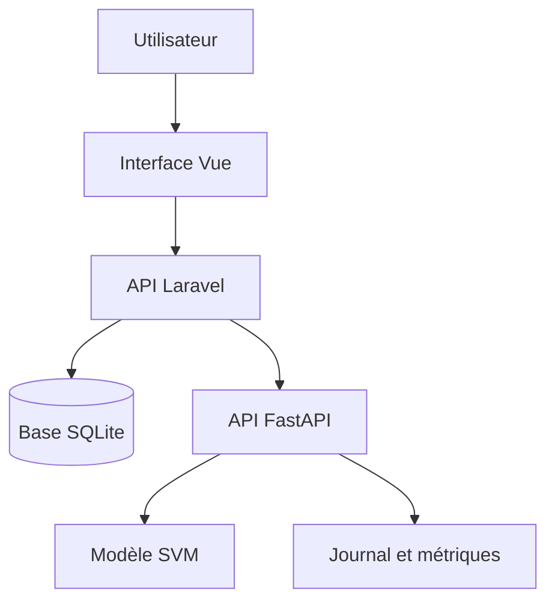

# Développement, sécurité, accessibilité et gestion des données — ReviewPro

## 1. Objectif

Ce document présente les composants techniques et les interfaces développés pour ReviewPro.

Il explique comment l’application respecte les spécifications fonctionnelles et techniques définies pour le projet, ainsi que les mesures appliquées concernant :

- l’accessibilité de l’interface ;
- la sécurité des échanges ;
- la validation des données ;
- la protection des données personnelles ;
- la qualité et la maintenabilité du code.

ReviewPro a été réalisé individuellement. Les choix, développements, tests et corrections décrits dans ce document ont donc été effectués par la même personne.

## 2. Besoin fonctionnel couvert

ReviewPro doit permettre à une entreprise d’exploiter des avis portant sur des produits électroniques.

L’application répond principalement aux besoins suivants :

1. afficher des indicateurs sur les avis collectés ;
2. consulter la répartition des sentiments ;
3. repérer les produits recevant le plus de plaintes ;
4. soumettre un texte à un service d’intelligence artificielle ;
5. afficher la famille de plainte prédite ;
6. signaler les prédictions incertaines ;
7. rendre les données disponibles par des API REST ;
8. conserver la provenance des données et des imports.

## 3. Composants développés

L’application est organisée en trois composants principaux.

| Composant | Technologie | Responsabilité |
|---|---|---|
| Interface utilisateur | Vue 3 et Vite | Saisie, affichage des résultats et tableau de bord |
| API applicative | Laravel | Validation, règles métier, accès aux données et connexion au service IA |
| Service IA | FastAPI et scikit-learn | Chargement du modèle, prédiction, monitorage et feedback |

La base SQLite est utilisée pour le prototype. Elle stocke notamment les avis, les produits, les marques, les sources et les lots d’import.

## 4. Organisation applicative



Cette séparation limite les responsabilités de chaque composant :

- Vue gère l’interaction avec l’utilisateur ;
- Laravel protège et orchestre les fonctionnalités métier ;
- FastAPI expose le modèle d’intelligence artificielle ;
- le modèle ne dépend pas directement de l’interface ;
- les données applicatives restent gérées par Laravel.

## 5. Interface du tableau de bord

Le composant `Dashboard.vue` consomme la route :

```text
GET /api/dashboard
```

Le tableau de bord affiche notamment :

- le nombre total d’avis ;
- la note moyenne ;
- le nombre d’avis positifs ;
- le nombre d’avis neutres ;
- le nombre d’avis négatifs ;
- les produits qui reçoivent le plus de plaintes.

Les valeurs proviennent de requêtes exécutées par Laravel. Elles ne sont pas écrites en dur dans l’interface.

Cette solution garantit que le tableau de bord reflète l’état actuel de la base de données.

## 6. Interface d’analyse par intelligence artificielle

Le composant `AiAnalyzer.vue` permet de saisir un avis et d’obtenir une classification.

Le scénario nominal est le suivant :

1. l’utilisateur saisit un avis ;
2. Vue vérifie la longueur minimale ;
3. Vue envoie le texte à Laravel ;
4. Laravel valide à nouveau la requête ;
5. Laravel appelle FastAPI ;
6. FastAPI applique le modèle SVM ;
7. le résultat revient à Laravel puis à Vue ;
8. l’interface affiche la catégorie et le niveau de confiance.

La route utilisée côté Laravel est :

```text
POST /api/ai/predict
```

Exemple de requête :

```json
{
  "text": "The charging port is broken and the battery will not charge."
}
```

Exemple simplifié de réponse :

```json
{
  "prediction_id": 10,
  "category": "device_hardware",
  "label": "Matériel, batterie, écran ou audio",
  "margin": 1.544041,
  "threshold": 0.3,
  "needs_review": false
}
```

## 7. Gestion des prédictions incertaines

Le modèle fournit une marge correspondant à l’écart entre les deux meilleurs scores.

La décision automatique utilise un seuil de `0,3` :

- si la marge est supérieure ou égale au seuil, la prédiction est considérée comme exploitable ;
- si la marge est inférieure au seuil, une vérification humaine est demandée.

L’interface ne présente donc pas toutes les prédictions comme certaines.

Deux états visuels sont utilisés :

- un résultat vert pour une prédiction exploitable ;
- un résultat orange accompagné du texte « Vérification humaine nécessaire » pour une prédiction incertaine.

La couleur n’est pas le seul moyen de transmettre l’information : un texte explicite est également affiché.

## 8. Accessibilité du formulaire IA

L’interface d’analyse a été modifiée afin de renforcer son accessibilité.

Les mesures appliquées sont notamment :

- présence d’un libellé explicite pour le champ de saisie ;
- association de l’aide au champ ;
- indication de la longueur autorisée ;
- compteur de caractères ;
- navigation possible au clavier ;
- état désactivé du bouton pendant le traitement ;
- focus visible ;
- annonce des erreurs ;
- annonce du résultat ;
- déplacement du focus vers l’erreur ou le résultat lorsque cela est nécessaire ;
- contraste visuel entre le texte et l’arrière-plan ;
- information transmise par le texte et non uniquement par la couleur.

La langue principale de la page a également été définie en français dans `index.html`.

## 9. Tests automatisés d’accessibilité

Les tests du composant Vue utilisent :

- Vitest ;
- Vue Test Utils ;
- jsdom ;
- axe-core.

La commande utilisée est :

```bash
npm run test:accessibility
```

Le résultat obtenu est :

```text
1 fichier de test réussi
4 tests réussis
```

Les comportements vérifiés sont :

1. le champ possède un libellé et une aide associés ;
2. une erreur de validation est annoncée et reçoit le focus ;
3. le résultat est annoncé et reçoit le focus ;
4. axe-core ne détecte aucune violation automatique sur le composant testé.

L’absence de violation automatique ne remplace pas une vérification humaine complète. Une revue au clavier et avec un lecteur d’écran reste recommandée avant la production.

## 10. Validation des entrées

La validation est effectuée à plusieurs niveaux.

### 10.1 Dans Vue

Le texte est nettoyé avec `trim()`.

Une erreur est affichée lorsque le texte contient moins de trois caractères.

La zone de texte est limitée à 5 000 caractères.

### 10.2 Dans Laravel

Le contrôleur Laravel vérifie la présence et le format des paramètres avant d’appeler le service IA ou la base de données.

Les filtres de l’API des avis sont contrôlés :

| Paramètre | Règle principale |
|---|---|
| `per_page` | entier compris entre 1 et 100 |
| `sentiment` | positive, neutral ou negative |
| `note` | nombre compris entre 1 et 5 |
| `brand_id` | identifiant existant |
| `product_id` | identifiant existant |
| `source` | chaîne limitée à 100 caractères |
| `search` | chaîne limitée à 100 caractères |

### 10.3 Dans FastAPI

Le schéma Pydantic impose :

```python
text: str = Field(min_length=3, max_length=5000)
```

Cette défense en profondeur évite de faire confiance uniquement au navigateur.

## 11. Sécurisation de l’appel au service IA

Laravel ne construit pas librement l’adresse du service IA à partir d’une saisie utilisateur.

La configuration utilise des variables d’environnement :

```text
AI_SERVICE_URL=http://127.0.0.1:8001
AI_SERVICE_TIMEOUT=10
```

Le connecteur applique un délai maximal. Une indisponibilité du service IA produit une réponse contrôlée avec le code HTTP `503` au lieu de bloquer indéfiniment l’application.

Le navigateur communique avec Laravel. Il n’a donc pas besoin de connaître directement les chemins internes du modèle.

## 12. Protection des secrets

Les secrets ne doivent pas être inscrits dans le code source.

Les mesures appliquées sont :

- exclusion du fichier `.env` par Git ;
- présence d’un fichier `.env.example` sans clé secrète ;
- retrait de la clé Google Places précédemment présente ;
- recherche de motifs de clés avant le versionnement ;
- configuration des services par variables d’environnement.

Une recherche locale n’a détecté aucun secret évident dans les fichiers du frontend.

Pour la production, les secrets devront être stockés dans le gestionnaire de secrets de la plateforme de déploiement.

## 13. Gestion des erreurs

L’application traite plusieurs catégories d’erreurs.

| Situation | Comportement attendu |
|---|---|
| Texte absent ou invalide | Réponse de validation et message accessible |
| Service IA indisponible | Réponse HTTP 503 contrôlée |
| Paramètre de filtre invalide | Réponse HTTP 422 |
| Erreur de chargement du tableau de bord | Message compréhensible dans l’interface |
| Prédiction incertaine | Demande de vérification humaine |

Les messages présentés à l’utilisateur restent compréhensibles et n’exposent pas une trace technique complète.

Les détails utiles au diagnostic sont conservés côté serveur par la journalisation.

## 14. Sécurité de la base de données

Laravel utilise Eloquent et le Query Builder pour construire les requêtes applicatives.

Cette approche utilise des paramètres liés et limite le risque d’injection SQL associé à la concaténation directe de données non fiables.

Les migrations définissent aussi des contraintes :

- clés primaires ;
- clés étrangères ;
- valeurs uniques pour certains identifiants ;
- relations avec suppression `RESTRICT`, `CASCADE` ou `SET NULL` selon le besoin ;
- champs obligatoires ;
- valeurs par défaut.

La pagination est limitée à 100 avis par page afin d’éviter une requête excessivement volumineuse.

## 15. Protection et minimisation des données

La finalité du projet est l’analyse des plaintes. L’identité réelle de l’auteur n’est pas nécessaire à cette finalité.

Les imports Datafiniti appliquent les règles suivantes :

- le nom d’utilisateur du fichier n’est pas importé ;
- `auteur` reçoit la valeur `null` ;
- `is_anonymized` reçoit la valeur `true` ;
- un hash du contenu contribue au contrôle des doublons ;
- la source et le lot d’import sont conservés pour la traçabilité.

La collecte Google a également été corrigée pour ne plus conserver le nom brut de l’auteur dans les nouveaux avis collectés.

Le texte complet d’un avis n’est pas enregistré dans les journaux du service IA. Le monitorage conserve uniquement les informations nécessaires au suivi technique et statistique.

## 16. Traçabilité des données

La table `data_sources` conserve :

- le nom et le code de la source ;
- son type ;
- son URL d’origine ;
- les informations de licence ;
- la date de vérification des conditions ;
- les notes RGPD ;
- son état actif ou inactif.

La table `import_batches` conserve :

- le fichier traité ;
- le statut de l’import ;
- le nombre de lignes lues ;
- le nombre de lignes importées ;
- le nombre de lignes rejetées ;
- le nombre de doublons ;
- le nombre de lignes ignorées ;
- les dates de début et de fin ;
- le message d’erreur éventuel.

Cette traçabilité permet de justifier la provenance d’un avis et de diagnostiquer un import défaillant.

## 17. Détection des doublons et intégrité

Les avis importés sont identifiés par la combinaison de leur source et de leur identifiant d’origine.

Lorsqu’un identifiant d’avis n’est pas disponible, le script génère une empreinte à partir d’éléments stables.

Le contenu est nettoyé puis transformé en hash SHA-256.

Ces mécanismes permettent :

- d’éviter la réimportation du même avis ;
- de rendre les imports relançables ;
- de compter les doublons dans le lot ;
- de contrôler la qualité du jeu final.

## 18. Sécurité du service IA

Le service FastAPI applique les mesures suivantes :

- validation stricte du corps JSON ;
- taille maximale du texte ;
- réponse structurée par un modèle Pydantic ;
- endpoint de santé séparé ;
- absence du texte brut dans le journal de prédiction ;
- métriques techniques sans identité d’auteur ;
- chargement d’un modèle et de métadonnées versionnés ;
- vérification du dataset et du modèle par des tests automatisés.

Le conteneur du service utilise uniquement les dépendances nécessaires à son exécution.

## 19. Qualité et maintenabilité du code

La séparation des responsabilités facilite la maintenance :

- composants Vue pour l’affichage ;
- contrôleurs Laravel pour les routes ;
- services Laravel pour les connexions externes ;
- modèles Eloquent pour les données ;
- application FastAPI pour l’inférence ;
- module distinct pour le monitorage ;
- scripts séparés pour l’entraînement, l’évaluation et le packaging ;
- tests séparés par responsabilité.

Les dépendances Python d’exécution et de test sont séparées dans :

```text
requirements-ai-runtime.txt
requirements-ai-test.txt
```

Cette séparation réduit le contenu du conteneur de production et rend l’environnement reproductible.

## 20. Tests techniques réalisés

### 20.1 Backend Laravel

La commande :

```bash
php artisan test
```

a produit :

```text
8 tests réussis
25 assertions
```

Les tests couvrent notamment :

- une prédiction réussie ;
- la présence obligatoire du texte ;
- l’indisponibilité du service IA ;
- la pagination des avis ;
- le filtre par sentiment ;
- le filtre par marque ;
- la limite de 100 résultats par page.

### 20.2 Service IA

La commande :

```bash
python -m pytest -q
```

a produit :

```text
39 tests réussis
```

Les tests portent sur le dataset, le modèle, la qualité, l’API et le monitorage.

### 20.3 Frontend Vue

La commande :

```bash
npm run build
```

a produit une version de production sans erreur.

Les quatre tests d’accessibilité du composant IA sont également réussis.

## 21. Critères d’acceptation vérifiés

| Critère | État | Preuve |
|---|---|---|
| Le tableau de bord charge les statistiques | Réalisé | Route `/api/dashboard` et démonstration |
| Un avis peut être envoyé au service IA | Réalisé | Route `/api/ai/predict` |
| La catégorie prédite est affichée | Réalisé | Composant `AiAnalyzer.vue` |
| Une prédiction incertaine est signalée | Réalisé | `needs_review` et affichage orange |
| Les entrées sont validées | Réalisé | Vue, Laravel et Pydantic |
| Une panne IA est gérée | Réalisé | Réponse 503 et test Laravel |
| L’interface IA est testée automatiquement | Réalisé | Vitest et axe-core |
| Les auteurs importés sont minimisés | Réalisé pour les nouveaux imports | `auteur=null`, `is_anonymized=true` |
| Les secrets sont hors du dépôt | Réalisé | `.gitignore` et variables d’environnement |

## 22. Limites avant une mise en production

Le prototype répond aux besoins de démonstration, mais plusieurs mesures restent nécessaires avant une ouverture publique.

### 22.1 Authentification et autorisation

La création d’un avis utilise encore un `user_id` fixé à `1` dans un contrôleur Laravel.

La route de suppression n’est pas encore protégée par une autorisation métier complète.

Avant la production, il faudra :

1. mettre en place l’authentification ;
2. utiliser l’utilisateur authentifié ;
3. définir des rôles et permissions ;
4. protéger les routes de création, feedback et suppression ;
5. tester les refus d’accès.

### 22.2 Transport sécurisé

Les services utilisent HTTP sur `127.0.0.1` pour le développement local.

La production devra utiliser HTTPS et des certificats valides.

### 22.3 Limitation des requêtes

Une limitation de débit devra être ajoutée sur les routes de prédiction et de feedback afin de réduire les abus et les surcharges.

### 22.4 Politique de conservation

La durée de conservation est identifiée dans la documentation RGPD, mais la purge automatique n’est pas encore programmée.

### 22.5 Protection du monitorage

Les endpoints de métriques, de synthèse, d’alertes et de feedback devront être limités aux personnes ou services autorisés.

### 22.6 Base de production

SQLite convient au prototype et aux tests. PostgreSQL est recommandé pour un environnement multi-utilisateur en production.

## 23. Plan d’amélioration priorisé

| Priorité | Action | Objectif |
|---|---|---|
| Critique | Protéger les routes sensibles | Éviter les accès non autorisés |
| Critique | Remplacer `user_id=1` | Garantir l’identité du créateur |
| Haute | Ajouter HTTPS | Protéger les échanges réseau |
| Haute | Protéger les endpoints de monitorage | Limiter l’exposition technique |
| Haute | Programmer la conservation et la purge | Renforcer la conformité RGPD |
| Moyenne | Ajouter une limitation de débit | Réduire les abus |
| Moyenne | Tester avec un lecteur d’écran | Compléter les tests automatiques |
| Moyenne | Migrer vers PostgreSQL | Préparer la montée en charge |
| Moyenne | Centraliser les journaux | Faciliter le diagnostic |

## 24. Démonstration prévue devant le jury

La démonstration peut suivre ce scénario :

1. ouvrir le tableau de bord et présenter les indicateurs ;
2. expliquer que les valeurs proviennent de Laravel et de la base ;
3. saisir un avis clairement lié à un problème matériel ;
4. lancer l’analyse ;
5. présenter la catégorie, la marge et le classement ;
6. saisir un texte ambigu afin de montrer la vérification humaine ;
7. naviguer uniquement au clavier dans le formulaire ;
8. présenter les résultats des tests Vue, Laravel et Python ;
9. expliquer la gestion du code HTTP 503 lorsque le service IA est arrêté ;
10. présenter les limites de sécurité restant à traiter avant la production.

## 25. Correspondance avec la compétence RNCP

Cette réalisation démontre :

- le développement d’une interface Vue conforme au besoin ;
- le développement de contrôleurs et de services Laravel ;
- le développement d’une API FastAPI exposant le modèle ;
- l’intégration des trois composants ;
- la validation des entrées à plusieurs niveaux ;
- l’application de règles d’accessibilité ;
- la programmation de tests d’accessibilité ;
- la gestion des erreurs et des indisponibilités ;
- la protection des secrets ;
- la minimisation et la traçabilité des données ;
- l’application de contraintes d’intégrité ;
- l’identification transparente des limites avant production.

## 26. Conclusion

ReviewPro dispose d’une interface Vue, d’une API Laravel et d’un service FastAPI réellement intégrés. L’utilisateur peut consulter les statistiques, soumettre un avis et comprendre si la prédiction peut être exploitée ou doit être vérifiée.

Les validations, les tests, la minimisation des données et les règles d’accessibilité apportent des garanties adaptées au prototype évalué.

Le projet ne doit toutefois pas être présenté comme entièrement sécurisé pour une ouverture publique. L’authentification, les autorisations, HTTPS, la limitation de débit et la purge automatique constituent les principales actions à terminer avant une mise en production réelle.
