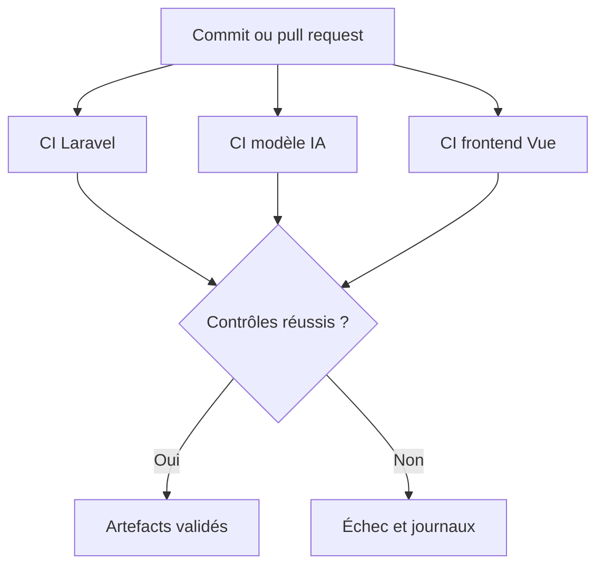

# Intégration continue de l’application — ReviewPro

## 1. Objectif

L’intégration continue de ReviewPro automatise les contrôles techniques lors du versionnement des sources.

À chaque modification envoyée sur la branche `main`, GitHub Actions prépare un environnement propre, installe les dépendances et exécute les validations prévues.

L’objectif est de détecter rapidement :

- une erreur de syntaxe ;
- une migration inutilisable sur une base vierge ;
- une régression dans l’API Laravel ;
- une rupture du contrat de l’API d’intelligence artificielle ;
- une dégradation des métriques minimales du modèle ;
- une erreur d’accessibilité détectable automatiquement ;
- une impossibilité de construire le frontend ;
- une image Docker qui ne démarre pas correctement.

## 2. Périmètre technique

ReviewPro est réparti dans deux dépôts GitHub.

| Dépôt | Contenu principal | Workflow |
|---|---|---|
| `Thiaba03/reviewpro-ai-mlops` | Laravel, FastAPI, modèle IA et MLOps | `application-ci.yml` et `model-ci-cd.yml` |
| `Thiaba03/reviewpro-frontend` | Interface Vue | `frontend-ci.yml` |

Cette séparation permet d’exécuter des contrôles adaptés à chaque technologie.

## 3. Déclenchement des workflows

Les workflows sont déclenchés lors :

- d’un push sur la branche `main` ;
- d’une pull request vers `main` ;
- d’un lancement manuel avec `workflow_dispatch`.

Le workflow du modèle réagit également aux tags de version suivant le format :

```text
ai-v*
```

Exemple :

```text
ai-v1.0.0
```

## 4. Vue générale de la chaîne CI



La validation n’est donc pas limitée au modèle : elle couvre les trois parties applicatives.

## 5. Workflow Laravel

Le workflow est stocké dans :

```text
.github/workflows/application-ci.yml
```

Il utilise une machine GitHub `ubuntu-latest` et PHP 8.4.

### 5.1 Installation de l’environnement

Les actions principales sont :

```yaml
uses: actions/checkout@v7.0.1
```

et :

```yaml
uses: shivammathur/setup-php@v2
```

Les extensions nécessaires sont installées :

- `mbstring` ;
- `pdo_sqlite` ;
- `sqlite3`.

Composer version 2 est également configuré.

### 5.2 Validation de Composer

La commande suivante vérifie la cohérence des fichiers Composer :

```bash
composer validate --no-check-publish
```

Elle permet notamment de détecter un fichier `composer.json` invalide.

### 5.3 Préparation des répertoires Laravel

Un environnement GitHub est créé à partir des seuls fichiers versionnés.

Les dossiers nécessaires sont donc explicitement créés :

```bash
mkdir -p bootstrap/cache
mkdir -p storage/framework/cache/data
mkdir -p storage/framework/sessions
mkdir -p storage/framework/views
mkdir -p storage/logs
chmod -R u+rwX bootstrap/cache storage
```

Cette étape garantit que Composer et Laravel peuvent écrire leurs fichiers temporaires.

### 5.4 Installation reproductible des dépendances

Le workflow utilise le fichier `composer.lock` :

```bash
composer install \
  --no-interaction \
  --prefer-dist \
  --no-progress
```

La CI installe ainsi les versions enregistrées dans le dépôt.

### 5.5 Préparation de Laravel

Les commandes suivantes préparent l’application :

```bash
cp .env.example .env
touch database/database.sqlite
php artisan key:generate
php artisan config:clear
```

Le fichier `.env` de production n’est jamais utilisé par la CI.

### 5.6 Vérification de la syntaxe PHP

Tous les fichiers PHP utiles sont analysés avec `php -l` :

```bash
find app config database routes tests \
  -type f \
  -name "*.php" \
  -print0 \
| xargs -0 -n1 php -l
```

Cette étape interrompt le workflow si un fichier contient une erreur de syntaxe.

### 5.7 Validation des migrations

La commande suivante reconstruit une base SQLite vierge :

```bash
php artisan migrate:fresh --force
```

Ce contrôle est important car une migration peut fonctionner sur une base existante tout en échouant lors d’une nouvelle installation.

Les dix-sept migrations de ReviewPro ont été exécutées avec succès dans l’environnement de CI.

### 5.8 Tests Laravel

Les tests utilisent une base SQLite en mémoire :

```yaml
DB_CONNECTION: sqlite
DB_DATABASE: ":memory:"
```

La commande exécutée est :

```bash
php artisan test \
  --log-junit storage/logs/junit-laravel.xml
```

Le résultat actuel est :

```text
8 tests réussis
25 assertions
```

### 5.9 Rapport Laravel

Le rapport JUnit est publié comme artefact GitHub :

```text
laravel-test-results
```

La durée de conservation configurée est de trente jours.

## 6. Workflow du modèle et du service IA

Le workflow existant est stocké dans :

```text
.github/workflows/model-ci-cd.yml
```

Il contient trois jobs.

### 6.1 Validation du modèle

Le job `validate-model` :

- installe Python 3.9 ;
- installe les dépendances de test ;
- vérifie la syntaxe Python ;
- teste le dataset ;
- teste le modèle ;
- teste le contrat FastAPI ;
- teste le monitorage ;
- vérifie les seuils de qualité ;
- construit le paquet versionné.

La suite contient actuellement :

```text
39 tests réussis
```

### 6.2 Test du conteneur

Le job `test-container` dépend de la validation du modèle.

Il :

1. construit l’image `reviewpro-ai:test` ;
2. démarre un conteneur ;
3. appelle l’endpoint `/health` ;
4. affiche les journaux en cas d’échec ;
5. supprime le conteneur à la fin.

Une image qui ne démarre pas ou dont l’API n’est pas disponible ne peut donc pas être publiée.

### 6.3 Artefacts du modèle

Les preuves suivantes sont conservées :

- résultat détaillé de pytest ;
- rapport de couverture ;
- paquet compressé du modèle ;
- manifeste contenant les versions, empreintes et métriques.

L’artefact se nomme :

```text
reviewpro-ai-validation
```

## 7. Workflow du frontend Vue

Le workflow est stocké dans le dépôt frontend :

```text
.github/workflows/frontend-ci.yml
```

### 7.1 Environnement Node.js

Il utilise :

```yaml
uses: actions/setup-node@v7.0.0
```

avec Node.js 24 et le cache npm.

### 7.2 Installation reproductible

La commande :

```bash
npm ci
```

installe les versions exactes du fichier `package-lock.json`.

Contrairement à `npm install`, elle est adaptée aux environnements automatisés et échoue si le manifeste et le verrou ne sont pas cohérents.

### 7.3 Tests du frontend

La commande :

```bash
npm test
```

exécute Vitest.

Les tests actuels vérifient notamment :

- l’association du libellé et de l’aide au champ ;
- l’annonce et le focus de l’erreur ;
- l’annonce et le focus du résultat ;
- l’absence de violation automatique axe-core sur le composant IA testé.

Le résultat actuel est :

```text
4 tests réussis
```

### 7.4 Construction de production

La commande suivante vérifie que Vite peut générer l’application :

```bash
npm run build
```

Une erreur d’import, de syntaxe Vue ou de dépendance fait échouer la CI.

### 7.5 Artefact frontend

Le dossier `dist` produit est publié sous le nom :

```text
reviewpro-frontend-dist
```

Cet artefact prouve que les sources validées peuvent être transformées en fichiers statiques distribuables.

## 8. Résultats des exécutions

| Partie | Workflow | Résultat | Preuve |
|---|---|---|---|
| Backend Laravel | Application Backend CI | Réussi | Exécution `32743765169` |
| Frontend Vue | Frontend CI | Réussi | Exécution `32744160943` |
| Modèle et API IA | Model CI CD | Réussi | Exécutions GitHub antérieures et artefact de validation |
| Conteneur IA | Model CI CD | Réussi | Job `test-container` |

L’exécution Laravel a produit :

```text
✓ Tester Laravel
Artefact : laravel-test-results
```

L’exécution frontend a produit :

```text
✓ Tester et construire Vue
Artefact : reviewpro-frontend-dist
```

## 9. Incident détecté par la CI

### 9.1 Symptôme

La première exécution du workflow Laravel a échoué pendant `composer install`.

Le message était :

```text
The bootstrap/cache directory must be present and writable.
```

L’exécution en échec porte l’identifiant :

```text
32743052810
```

### 9.2 Cause

Le dossier existait sur l’ordinateur de développement, mais Git ne versionne pas un dossier vide.

Lors du clonage dans une machine GitHub neuve, `bootstrap/cache` était donc absent.

Composer lançait ensuite :

```text
php artisan package:discover
```

Laravel ne pouvait pas générer son manifeste de paquets.

### 9.3 Correction

Une étape a été ajoutée avant `composer install` pour créer les répertoires nécessaires et appliquer des permissions d’écriture.

### 9.4 Vérification

Après la correction, l’exécution `32743765169` a terminé avec succès en vingt-cinq secondes.

Le job Laravel et la publication de l’artefact JUnit ont réussi.

Cet incident démontre que la CI exécute réellement le projet dans un environnement neuf et permet d’identifier une hypothèse cachée de l’environnement local.

## 10. Stratégie de blocage

Chaque étape utilise le comportement d’échec standard de GitHub Actions.

Lorsqu’une commande retourne un code différent de zéro :

- le job est marqué en échec ;
- les étapes dépendantes ne sont pas exécutées ;
- les journaux restent accessibles ;
- la version n’est pas considérée comme validée.

Le job Docker dépend de la validation du modèle grâce à :

```yaml
needs: validate-model
```

La publication de l’image dépend ensuite du test du conteneur.

## 11. Gestion des artefacts

| Artefact | Contenu | Conservation |
|---|---|---:|
| `laravel-test-results` | Rapport JUnit Laravel | 30 jours |
| `reviewpro-ai-validation` | Tests, couverture, modèle et manifeste | 30 jours |
| `reviewpro-frontend-dist` | Build de production Vue | 30 jours |

Les artefacts permettent de consulter les preuves sans reproduire immédiatement l’environnement local.

Ils ne contiennent pas le fichier `.env` ni de clé secrète.

## 12. Sécurité de la chaîne

Les workflows appliquent les principes suivants :

- permission globale `contents: read` ;
- permissions d’écriture accordées uniquement au job de publication nécessaire ;
- utilisation de `${{ secrets.GITHUB_TOKEN }}` pour le registre GitHub ;
- absence de secrets écrits dans le YAML ;
- fichier `.env.example` sans clé réelle ;
- dépendances installées depuis les fichiers de verrouillage ;
- environnement éphémère pour chaque exécution.

## 13. Reproductibilité

La chaîne utilise :

- `composer.lock` pour PHP ;
- `package-lock.json` pour Node.js ;
- des fichiers de dépendances Python versionnés ;
- des versions explicites de PHP, Python et Node.js ;
- un modèle et des métadonnées versionnés ;
- un manifeste avec des empreintes SHA-256 ;
- Docker pour reproduire le service IA.

Ces éléments réduisent les différences entre l’ordinateur local et GitHub Actions.

## 14. Limites actuelles

La chaîne peut encore être améliorée.

| Limite | Amélioration envisagée |
|---|---|
| Peu de tests fonctionnels Vue | Tester davantage le tableau de bord |
| Pas de test navigateur complet | Ajouter Playwright ou Cypress |
| Pas d’analyse statique PHP dédiée | Ajouter PHPStan ou Larastan |
| Pas d’analyse des dépendances dans le workflow | Ajouter une étape de sécurité adaptée |
| Frontend et backend dans deux dépôts | Documenter la compatibilité des versions |
| Pas d’environnement de préproduction complet | Ajouter un déploiement staging |

Ces limites n’empêchent pas la CI actuelle de détecter les principales régressions du prototype.

## 15. Procédure de diagnostic d’un échec

En cas d’échec :

1. identifier le workflow et le job en erreur ;
2. afficher les journaux avec `gh run view --log-failed` ;
3. relever la première erreur pertinente ;
4. reproduire la commande localement si possible ;
5. corriger la cause dans une branche ou localement ;
6. exécuter les tests avant le push ;
7. versionner la correction ;
8. vérifier la nouvelle exécution ;
9. documenter l’incident si celui-ci est significatif.

Exemple de commande :

```bash
gh run view IDENTIFIANT \
  --repo Thiaba03/reviewpro-ai-mlops \
  --log-failed
```

## 16. Démonstration devant le jury

La démonstration peut suivre ce déroulement :

1. ouvrir l’onglet Actions du dépôt backend ;
2. montrer les deux workflows ;
3. ouvrir l’exécution Laravel réussie ;
4. présenter les étapes de syntaxe, migrations et tests ;
5. montrer l’artefact JUnit ;
6. ouvrir l’exécution frontend ;
7. présenter les tests et le build ;
8. montrer l’artefact `dist` ;
9. ouvrir l’exécution en échec `32743052810` ;
10. expliquer la cause et la correction ;
11. montrer une exécution Model CI CD réussie ;
12. expliquer que la publication du conteneur est bloquée si les tests échouent.

## 17. Correspondance avec la compétence RNCP

Cette réalisation démontre :

- l’utilisation d’un outil d’intégration continue ;
- le déclenchement automatique lors du versionnement ;
- la préparation d’environnements de test reproductibles ;
- l’automatisation des tests Laravel ;
- la validation automatique des migrations ;
- la vérification automatique de la syntaxe PHP ;
- l’automatisation des tests du modèle et de FastAPI ;
- l’automatisation des tests d’accessibilité Vue ;
- la construction automatique du frontend ;
- la construction et le test du conteneur IA ;
- le blocage de la chaîne lors d’un échec ;
- la conservation de rapports et d’artefacts ;
- le diagnostic et la correction d’un incident réel de CI.

## 18. Conclusion

ReviewPro dispose désormais d’une intégration continue couvrant le backend Laravel, le frontend Vue et le service d’intelligence artificielle.

Les contrôles sont exécutés automatiquement dans des environnements propres lors des pushs et des pull requests. Les rapports et builds sont conservés sous forme d’artefacts.

La première exécution Laravel a détecté un défaut de préparation invisible sur l’ordinateur local. Sa correction puis la réussite de la nouvelle exécution montrent concrètement l’intérêt de l’intégration continue pour garantir la qualité technique de l’application.
