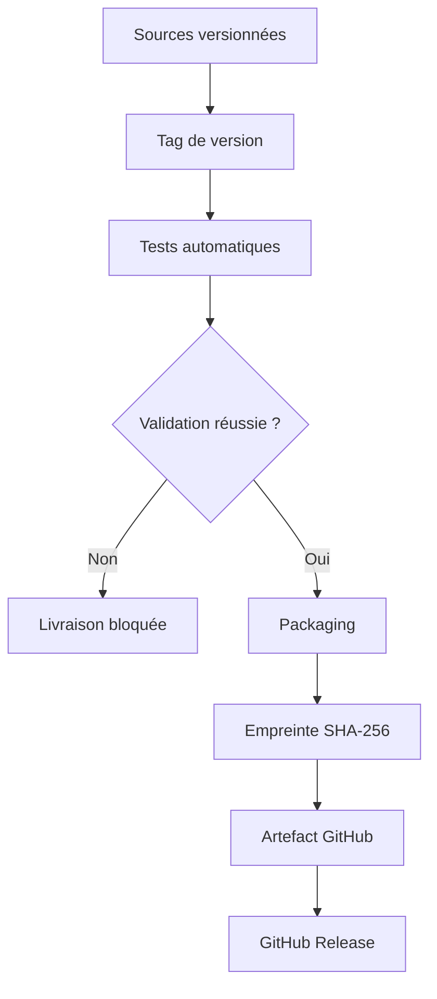

# Livraison continue de l’application — ReviewPro

## 1. Objectif

La livraison continue de ReviewPro automatise la préparation de versions utilisables de l’application après leur validation technique.

Le processus transforme les sources versionnées en livrables identifiés, testés, compressés et vérifiables.

Il couvre les trois composants principaux :

- le service d’intelligence artificielle ;
- le backend Laravel ;
- le frontend Vue.

La destination actuelle est GitHub Actions, GitHub Releases et GitHub Container Registry pour l’image IA.

Le déploiement sur un serveur public de production n’est pas automatique à ce stade. Le projet met donc en œuvre une **livraison continue**, et non un déploiement continu complet.

## 2. Différence entre intégration, livraison et déploiement

| Notion | Rôle dans ReviewPro |
|---|---|
| Intégration continue | Tester automatiquement chaque modification |
| Livraison continue | Préparer et publier automatiquement une version déployable |
| Déploiement continu | Installer automatiquement chaque version validée en production |

ReviewPro possède :

- une intégration continue pour Laravel, Vue et le modèle IA ;
- une livraison continue versionnée pour les trois composants ;
- une procédure de déploiement cible documentée ;
- aucun déploiement public automatique revendiqué.

## 3. Dépôts et responsabilités

| Dépôt | Composants | Tags de livraison |
|---|---|---|
| `Thiaba03/reviewpro-ai-mlops` | Laravel, FastAPI, modèle et monitorage | `backend-v*` et `ai-v*` |
| `Thiaba03/reviewpro-frontend` | Application Vue | `frontend-v*` |

Cette organisation permet de faire évoluer et de livrer chaque partie indépendamment.

Pour une version globale de l’application, les trois numéros doivent rester compatibles.

## 4. Livrables de la version 1.0.0

| Composant | Tag | Livrable principal | Destination |
|---|---|---|---|
| Modèle et API IA | `ai-v1.0.0` | Image Docker et paquet du modèle | GHCR et GitHub Release |
| Backend Laravel | `backend-v1.0.0` | `reviewpro-backend.tar.gz` | GitHub Release |
| Frontend Vue | `frontend-v1.0.0` | `reviewpro-frontend-dist.tar.gz` | GitHub Release |

Ces trois tags représentent la première version livrable de ReviewPro.

## 5. Vue générale du processus



Pour l’IA, une étape supplémentaire publie l’image dans le registre de conteneurs.

## 6. Stratégie de versionnement

Les tags utilisent un préfixe indiquant le composant.

```text
ai-v1.0.0
backend-v1.0.0
frontend-v1.0.0
```

Le numéro suit le principe de versionnement sémantique :

- le premier nombre correspond à une rupture majeure ;
- le deuxième correspond à une nouvelle fonctionnalité compatible ;
- le troisième correspond à une correction compatible.

Exemples :

```text
backend-v1.0.1 : correction du backend
frontend-v1.1.0 : nouvelle fonctionnalité du frontend
ai-v2.0.0 : changement incompatible du contrat IA
```

## 7. Livraison du backend Laravel

Le workflow est stocké dans :

```text
.github/workflows/backend-cd.yml
```

Il est déclenché :

- manuellement pour vérifier la chaîne ;
- automatiquement lors du push d’un tag `backend-v*`.

### 7.1 Validation avant livraison

Avant le packaging, le workflow :

1. installe PHP 8.4 ;
2. prépare les répertoires Laravel ;
3. installe les dépendances de développement ;
4. crée un environnement de test ;
5. exécute toutes les migrations ;
6. exécute les tests Laravel ;
7. génère un rapport JUnit.

Un échec interrompt la chaîne avant la création de la release.

### 7.2 Dépendances de production

Après les tests, les dépendances sont réinstallées avec :

```bash
composer install \
  --no-dev \
  --no-interaction \
  --prefer-dist \
  --no-progress \
  --optimize-autoloader
```

Le paquet ne contient donc pas les bibliothèques utilisées uniquement pour les tests.

L’autoloader est optimisé pour l’exécution.

### 7.3 Contenu du paquet backend

Le paquet contient notamment :

- `app` ;
- `bootstrap` ;
- `config` ;
- `database` ;
- `public` ;
- `resources` ;
- `routes` ;
- `storage` ;
- `vendor` ;
- `artisan` ;
- `composer.json` ;
- `composer.lock` ;
- `.env.example`.

### 7.4 Éléments exclus

Les éléments suivants ne sont pas livrés :

- le fichier `.env` local ;
- les secrets ;
- `database/database.sqlite` ;
- les journaux locaux ;
- les dépendances de développement PHP.

Cette exclusion évite de publier des paramètres sensibles ou des données locales.

### 7.5 Livrables backend

Le workflow génère :

```text
reviewpro-backend.tar.gz
reviewpro-backend.tar.gz.sha256
```

Le paquet de la version `backend-v1.0.0` possède une taille d’environ 4,59 Mio.

L’empreinte permet de vérifier que le fichier téléchargé n’a pas été modifié.

### 7.6 Exécution de validation manuelle

La chaîne a d’abord été déclenchée manuellement.

```text
Exécution : 32744998368
Résultat : succès
Artefact : reviewpro-backend-release
```

La création de la GitHub Release a été ignorée, car aucun tag de version n’était utilisé.

### 7.7 Exécution officielle

Le tag `backend-v1.0.0` a déclenché :

```text
Exécution : 32745131135
Résultat : succès
```

Toutes les étapes ont réussi, y compris la création automatique de la GitHub Release.

## 8. Livraison du frontend Vue

Le workflow est stocké dans :

```text
.github/workflows/frontend-cd.yml
```

Il est déclenché :

- manuellement pour tester la chaîne ;
- automatiquement lors du push d’un tag `frontend-v*`.

### 8.1 Installation reproductible

Node.js 24 est installé avec le cache npm.

Les dépendances sont installées avec :

```bash
npm ci
```

Cette commande respecte exactement `package-lock.json`.

### 8.2 Contrôles avant livraison

Le workflow exécute :

```bash
npm test
npm run build
```

Les tests Vitest et axe-core doivent réussir avant la construction du paquet.

Le build Vite doit également terminer sans erreur.

### 8.3 Contenu du paquet frontend

Le dossier `dist` contient les fichiers statiques produits par Vite :

- la page HTML ;
- les fichiers JavaScript optimisés ;
- les feuilles de style ;
- les ressources publiques nécessaires.

Le code source, `node_modules` et les outils de développement ne sont pas nécessaires sur le serveur web final.

### 8.4 Livrables frontend

Le workflow génère :

```text
reviewpro-frontend-dist.tar.gz
reviewpro-frontend-dist.tar.gz.sha256
```

Le paquet officiel possède une taille d’environ 46,60 Kio.

### 8.5 Exécution de validation manuelle

```text
Exécution : 32745460501
Résultat : succès
Artefact : reviewpro-frontend-release
```

### 8.6 Exécution officielle

Le tag `frontend-v1.0.0` a déclenché :

```text
Exécution : 32745628919
Résultat : succès
```

La GitHub Release a été créée automatiquement avec le paquet et son empreinte.

## 9. Livraison du service d’intelligence artificielle

Le workflow IA est stocké dans :

```text
.github/workflows/model-ci-cd.yml
```

Il valide le dataset, le modèle, l’API FastAPI, le monitorage et l’image Docker.

### 9.1 Tag officiel

La première version utilise :

```text
ai-v1.0.0
```

### 9.2 Paquet du modèle

La release contient :

```text
reviewpro-ai-model.tar.gz
manifest.json
```

Le manifeste décrit notamment :

- le nom du modèle ;
- la date d’entraînement ;
- l’empreinte du dataset ;
- l’empreinte du modèle ;
- les classes ;
- les métriques de validation ;
- le seuil automatique.

### 9.3 Image de conteneur

Le workflow construit l’image, démarre un conteneur et vérifie `/health` avant la publication.

L’image est publiée dans GitHub Container Registry avec les tags :

```text
latest
ai-v1.0.0
```

La publication ne peut avoir lieu que si les tests et le contrôle de santé réussissent.

## 10. Artefacts et releases

| Composant | Artefact temporaire | Release officielle |
|---|---|---|
| Laravel | `reviewpro-backend-release` | `backend-v1.0.0` |
| Vue | `reviewpro-frontend-release` | `frontend-v1.0.0` |
| IA | `reviewpro-ai-validation` | `ai-v1.0.0` |

Les artefacts GitHub Actions sont conservés trente jours.

Les GitHub Releases constituent les versions officielles conservées dans l’historique du projet.

## 11. Vérification d’intégrité

Les paquets backend et frontend sont accompagnés d’un fichier `.sha256`.

Après téléchargement, la vérification peut être réalisée avec :

```bash
shasum -a 256 -c reviewpro-backend.tar.gz.sha256
```

ou :

```bash
shasum -a 256 -c reviewpro-frontend-dist.tar.gz.sha256
```

Un résultat valide confirme que le paquet correspond exactement au fichier construit par la chaîne.

## 12. Gestion des environnements

| Environnement | Usage | Données et configuration |
|---|---|---|
| Local | Développement et démonstration | `.env` local et SQLite |
| CI | Tests automatiques | Environnement éphémère et SQLite vierge |
| Livraison | Packaging et release | Aucun secret ni base locale |
| Préproduction cible | Validation fonctionnelle complète | Secrets dédiés et données de test |
| Production cible | Utilisation réelle | HTTPS, PostgreSQL, sauvegardes et supervision |

Le même fichier `.env` ne doit jamais être partagé entre ces environnements.

## 13. Procédure cible de déploiement du backend

Une personne autorisée peut suivre les étapes suivantes :

1. télécharger la release backend ;
2. vérifier l’empreinte SHA-256 ;
3. extraire le paquet dans un répertoire de version ;
4. créer un fichier `.env` propre à l’environnement ;
5. générer ou fournir `APP_KEY` ;
6. configurer PostgreSQL ou la base cible ;
7. configurer `AI_SERVICE_URL` ;
8. rendre `storage` et `bootstrap/cache` accessibles en écriture ;
9. exécuter les migrations avec contrôle ;
10. vider et reconstruire les caches Laravel ;
11. vérifier l’API de santé ou une route applicative ;
12. basculer le trafic vers la nouvelle version.

Commandes principales :

```bash
php artisan migrate --force
php artisan config:cache
php artisan route:cache
php artisan view:cache
```

## 14. Procédure cible de déploiement du frontend

Le paquet frontend contient déjà les fichiers construits.

La procédure consiste à :

1. télécharger la release ;
2. vérifier son empreinte ;
3. extraire `dist` ;
4. publier les fichiers sur un serveur statique ou un CDN ;
5. configurer la réécriture vers `index.html` si nécessaire ;
6. vérifier l’adresse de l’API Laravel ;
7. tester l’affichage du tableau de bord ;
8. tester une prédiction IA.

Le serveur doit appliquer HTTPS et des en-têtes de sécurité adaptés.

## 15. Procédure cible de déploiement de l’IA

Le service peut être démarré à partir de l’image publiée.

Exemple conceptuel :

```bash
docker pull ghcr.io/thiaba03/reviewpro-ai:ai-v1.0.0
docker run --detach --publish 8001:8001 \
  ghcr.io/thiaba03/reviewpro-ai:ai-v1.0.0
```

Après le démarrage, il faut vérifier :

```text
GET /health
GET /metrics
```

En production, les endpoints de monitorage doivent être protégés et le service doit être placé derrière une infrastructure sécurisée.

## 16. Contrôles après livraison

Une version n’est pas considérée comme correctement restituée uniquement parce que le fichier existe.

Les contrôles attendus sont :

- empreinte valide ;
- paquet extractible ;
- variables d’environnement définies ;
- migrations réussies ;
- frontend accessible ;
- API Laravel accessible ;
- service IA disponible ;
- prédiction fonctionnelle ;
- journaux sans erreur critique ;
- métriques collectées.

## 17. Stratégie de retour arrière

Les releases et tags sont immuables.

En cas d’incident :

1. arrêter le basculement vers la nouvelle version ;
2. conserver les journaux ;
3. réactiver la version précédente ;
4. restaurer la configuration compatible ;
5. analyser les migrations appliquées ;
6. corriger le code ;
7. publier une nouvelle version corrective.

Une migration destructive nécessite une sauvegarde et un plan de restauration spécifique.

Il ne faut pas supprimer ou modifier silencieusement une release déjà utilisée.

## 18. Sécurité de la livraison

Les mesures appliquées sont :

- utilisation du jeton GitHub fourni au workflow ;
- permission `contents: write` limitée aux workflows de release ;
- aucun secret écrit dans les fichiers YAML ;
- exclusion de `.env` ;
- exclusion de la base SQLite locale ;
- installation reproductible depuis les fichiers de verrouillage ;
- tests obligatoires avant le packaging ;
- empreintes SHA-256 ;
- image IA testée avant publication.

## 19. Limites actuelles

| Limite | Conséquence | Amélioration envisagée |
|---|---|---|
| Pas de serveur de préproduction | Pas de test automatique en situation déployée | Créer un environnement staging |
| Pas de production publique | Pas de validation réelle de montée en charge | Déployer sur une infrastructure cible |
| Trois versions séparées | Risque de versions incompatibles | Ajouter un manifeste global |
| Pas de test end-to-end après release | Les interactions complètes restent manuelles | Ajouter Playwright |
| Pas de signature cryptographique forte | SHA-256 contrôle l’intégrité mais pas l’identité seule | Signer les releases ou générer une attestation |
| Déploiement manuel après release | Intervention humaine nécessaire | Ajouter une étape de déploiement contrôlée |

Ces limites sont déclarées afin de ne pas présenter GitHub Releases comme un hébergement de production.

## 20. Améliorations recommandées

Les évolutions prioritaires sont :

1. créer un manifeste global `reviewpro-v1.0.0` associant les trois composants ;
2. ajouter un environnement GitHub `staging` ;
3. stocker les secrets de staging dans GitHub Environments ;
4. déployer automatiquement les releases sur staging ;
5. exécuter des tests end-to-end après déploiement ;
6. exiger une approbation humaine avant la production ;
7. centraliser les journaux ;
8. automatiser le retour arrière lorsque le contrôle de santé échoue.

## 21. Démonstration devant le jury

La démonstration peut suivre ce scénario :

1. présenter les trois workflows de livraison ;
2. montrer l’exécution manuelle backend `32744998368` ;
3. expliquer pourquoi elle ne crée pas de release ;
4. montrer l’exécution taguée `32745131135` ;
5. ouvrir la release `backend-v1.0.0` ;
6. présenter le paquet et son empreinte ;
7. montrer l’exécution frontend `32745628919` ;
8. ouvrir la release `frontend-v1.0.0` ;
9. montrer la release IA `ai-v1.0.0` ;
10. montrer l’image de conteneur versionnée ;
11. expliquer les exclusions de sécurité ;
12. préciser que le déploiement public reste une étape cible.

## 22. Correspondance avec la compétence RNCP

Cette réalisation démontre :

- la création d’un processus de livraison continue ;
- l’appui sur les tests de l’intégration continue ;
- le paramétrage d’environnements automatisés propres ;
- la validation avant packaging ;
- l’installation de dépendances de production ;
- la construction de livrables backend, frontend et IA ;
- le versionnement par tags ;
- la génération d’empreintes d’intégrité ;
- la publication d’artefacts ;
- la création automatique de GitHub Releases ;
- la publication d’une image Docker validée ;
- la protection des secrets et des données locales ;
- la description du déploiement, des contrôles et du retour arrière ;
- la distinction transparente entre livraison continue et déploiement continu.

## 23. Conclusion

ReviewPro possède désormais une chaîne de livraison continue pour ses trois composants.

Les tags `ai-v1.0.0`, `backend-v1.0.0` et `frontend-v1.0.0` ont déclenché des validations et des publications réelles. Les livrables sont identifiables, téléchargeables et accompagnés de preuves d’intégrité.

La chaîne garantit qu’une version ne peut pas être publiée par ces workflows si les validations prévues échouent. Elle facilite donc une restitution reproductible de l’application.

Le déploiement vers un environnement public reste volontairement présenté comme une évolution. La réalisation actuelle correspond à une livraison continue opérationnelle vers un registre et des releases versionnées.
