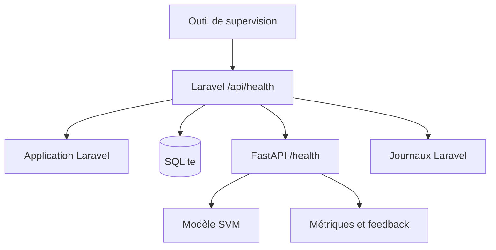

# Monitorage de l’application d’intelligence artificielle — ReviewPro

## 1. Objectif

Le monitorage de ReviewPro permet de surveiller l’application, ses dépendances et son service d’intelligence artificielle.

Il doit permettre :

- de vérifier la disponibilité des composants ;
- de mesurer la latence ;
- de détecter une dépendance indisponible ;
- de journaliser les incidents ;
- de surveiller les prédictions et les retours humains ;
- d’alimenter la boucle d’amélioration du modèle ;
- de respecter la minimisation des données personnelles.

Le dispositif couvre Laravel, SQLite, FastAPI et le modèle SVM.

## 2. Composants surveillés

| Composant | Contrôle principal | Résultat attendu |
|---|---|---|
| Frontend Vue | Build, tests et disponibilité de l’API | Interface utilisable |
| Laravel | `/up` et `/api/health` | HTTP 200 |
| Base de données | Requête `SELECT 1` | Connexion disponible |
| FastAPI | `/health` | Statut `ok` |
| Modèle IA | Métadonnées et prédictions | Modèle chargé |
| Prédictions | Métriques Prometheus et synthèse | Taux suivis |
| Feedback | Endpoint `/feedback` | Corrections enregistrées |
| Alertes IA | `/monitoring/alerts` | Liste des alertes |

## 3. Architecture du monitorage



L’endpoint Laravel fournit une vision consolidée de l’application.

Les endpoints FastAPI fournissent des informations détaillées sur le comportement du modèle.

## 4. Endpoint Laravel natif

Laravel expose déjà :

```text
GET /up
```

Cette route confirme que le framework peut répondre à une requête.

Elle ne vérifie cependant pas :

- la connexion à la base ;
- la disponibilité du service IA ;
- le chargement du modèle.

Un endpoint applicatif complémentaire a donc été développé.

## 5. Endpoint de santé consolidé

La route ajoutée est :

```text
GET /api/health
```

Elle utilise :

```text
App\Http\Controllers\Api\ApplicationHealthController
```

Le contrôleur vérifie successivement :

1. l’exécution de Laravel ;
2. la connexion à la base ;
3. l’endpoint `/health` de FastAPI ;
4. le modèle chargé et sa version ;
5. la durée totale du contrôle.

## 6. Contrôle de la base de données

La disponibilité de la base est testée par une requête minimale :

```sql
SELECT 1
```

Cette requête ne lit aucune donnée métier et ne manipule aucune donnée personnelle.

Lorsque le contrôle réussit, la réponse indique également le pilote utilisé :

```json
{
  "status": "ok",
  "connection": "sqlite"
}
```

En cas d’exception, le statut devient `unavailable` et l’endpoint global répond avec HTTP 503.

## 7. Contrôle du service IA

Laravel utilise la méthode :

```php
AiReviewClassifier::health()
```

Cette méthode appelle :

```text
GET http://127.0.0.1:8001/health
```

avec un délai maximal de cinq secondes.

La réponse FastAPI contient notamment :

- le statut ;
- le nom du modèle ;
- la version du modèle ;
- le nombre de lignes d’entraînement ;
- les classes ;
- le seuil de décision.

L’endpoint consolidé Laravel ne restitue que les informations utiles au diagnostic applicatif.

## 8. Structure de la réponse

Une réponse normale possède la structure suivante :

```json
{
  "status": "ok",
  "checked_at": "2026-08-24T15:47:40+00:00",
  "latency_ms": 6.34,
  "checks": {
    "application": {
      "status": "ok",
      "service": "reviewpro-laravel"
    },
    "database": {
      "status": "ok",
      "connection": "sqlite"
    },
    "ai_service": {
      "status": "ok",
      "model": "review_topic_macro_svm",
      "model_version": "2026-08-20T15:53:56.526347+00:00"
    }
  }
}
```

Le champ `checked_at` facilite la traçabilité du contrôle.

Le champ `latency_ms` permet de détecter une dégradation progressive du temps de réponse.

## 9. Codes HTTP

| Situation | Code | Statut JSON |
|---|---:|---|
| Laravel, base et IA disponibles | 200 | `ok` |
| Base indisponible | 503 | `degraded` |
| FastAPI indisponible | 503 | `degraded` |
| FastAPI déclare un état dégradé | 503 | `degraded` |

L’utilisation de HTTP 503 permet à un outil de supervision, un proxy ou un orchestrateur de détecter automatiquement l’incident.

## 10. Journalisation Laravel

Laravel utilise Monolog avec les canaux définis dans `config/logging.php`.

Le canal local par défaut écrit dans :

```text
storage/logs/laravel.log
```

La configuration propose aussi un canal journalier avec une durée configurable.

Exemple de configuration recommandée :

```text
LOG_CHANNEL=daily
LOG_LEVEL=warning
LOG_DAILY_DAYS=14
```

La durée doit être adaptée à la politique de conservation réelle du projet.

## 11. Événements journalisés par le contrôle

Le contrôleur journalise :

- une erreur lorsque la base est indisponible ;
- un avertissement lorsque FastAPI est indisponible ;
- un avertissement lorsque FastAPI répond avec un statut dégradé.

Exemple réel :

```text
local.WARNING: Application health check: AI service unavailable.
exception_class=Illuminate\Http\Client\ConnectionException
```

Le message permet d’identifier le composant concerné sans enregistrer le texte d’un avis.

## 12. Respect des données personnelles

Le monitorage applique les principes suivants :

- aucun texte brut d’avis dans le contrôle de santé ;
- aucun nom d’auteur ;
- aucun identifiant utilisateur ;
- aucun secret ;
- aucune clé d’API ;
- conservation limitée à des données techniques ;
- journalisation de la classe d’exception plutôt que d’un contenu utilisateur.

Les journaux peuvent néanmoins contenir des informations techniques sensibles. Leur accès doit être limité aux personnes autorisées.

## 13. Monitorage FastAPI

FastAPI expose plusieurs endpoints :

```text
GET /health
GET /metrics
GET /monitoring/summary
GET /monitoring/alerts
POST /feedback
```

Ces endpoints complètent le contrôle consolidé Laravel.

## 14. Métriques techniques et métier

Les métriques suivies comprennent :

- le nombre de prédictions ;
- le nombre de succès ;
- le nombre d’erreurs ;
- le taux d’erreur ;
- la latence de prédiction ;
- la marge moyenne ;
- le nombre de demandes de vérification humaine ;
- le taux de vérification ;
- la répartition des catégories ;
- le nombre de feedbacks ;
- la précision observée sur les feedbacks.

Ces indicateurs permettent de suivre à la fois la disponibilité technique et la qualité d’usage du modèle.

## 15. Métriques Prometheus

L’endpoint :

```text
GET /metrics
```

expose des métriques compatibles avec Prometheus.

Exemples déjà vérifiés :

```text
reviewpro_ai_predictions_total
reviewpro_ai_prediction_latency_seconds_count
reviewpro_ai_feedback_total
```

Les labels permettent de distinguer :

- la catégorie prédite ;
- le statut de la requête ;
- le besoin de vérification humaine ;
- la validité du feedback.

## 16. Synthèse temporelle

L’endpoint :

```text
GET /monitoring/summary?hours=24
```

calcule une synthèse sur une fenêtre temporelle.

Exemple obtenu pendant la démonstration :

```json
{
  "window_hours": 24,
  "requests": 1,
  "successes": 1,
  "errors": 0,
  "error_rate": 0.0,
  "needs_review": 0,
  "review_rate": 0.0,
  "average_margin": 1.544,
  "average_latency_ms": 2.76,
  "feedback_count": 1,
  "feedback_accuracy": 1.0
}
```

## 17. Détection des alertes

L’endpoint :

```text
GET /monitoring/alerts?hours=24
```

analyse les métriques de la fenêtre et retourne un statut et une liste d’alertes.

Un outil externe peut interroger régulièrement :

- `/api/health` pour l’état global ;
- `/monitoring/alerts` pour la qualité du service IA ;
- `/metrics` pour collecter les séries temporelles.

Le prototype détecte donc automatiquement l’état dégradé et le traduit par un statut machine exploitable.

En production, l’envoi vers un canal Slack, courriel, PagerDuty ou une plateforme similaire reste à configurer.

## 18. Boucle de feedback MLOps

Chaque prédiction reçoit un identifiant technique.

Une correction humaine peut être envoyée à :

```text
POST /feedback
```

Exemple :

```json
{
  "prediction_id": 10,
  "corrected_category": "device_hardware"
}
```

Le service indique si la prédiction initiale était correcte.

Les feedbacks peuvent ensuite être utilisés pour :

1. mesurer la qualité réelle ;
2. identifier les catégories confondues ;
3. préparer de nouvelles annotations ;
4. enrichir le dataset ;
5. réentraîner une nouvelle version ;
6. comparer ses métriques ;
7. publier uniquement si elle respecte les seuils.

## 19. Tests automatisés du monitorage IA

La suite Python contient des tests vérifiant :

- la journalisation d’une prédiction sans texte brut ;
- la synthèse des prédictions ;
- l’enregistrement d’une correction ;
- le rejet d’un feedback invalide ;
- l’exposition des métriques Prometheus ;
- l’endpoint d’alertes et la validation de ses paramètres.

La suite globale du service IA comporte :

```text
39 tests réussis
```

## 20. Tests automatisés du monitorage Laravel

Le fichier :

```text
tests/Feature/ApplicationHealthApiTest.php
```

contient trois scénarios.

### 20.1 Application disponible

Le test vérifie :

- HTTP 200 ;
- l’état de Laravel ;
- l’état de la base ;
- l’état de FastAPI ;
- le nom du modèle ;
- la date et la latence.

### 20.2 Service IA indisponible

Le test simule une erreur HTTP FastAPI et vérifie :

- HTTP 503 ;
- le statut global dégradé ;
- la base toujours disponible ;
- le service IA indisponible ;
- l’écriture d’un avertissement.

### 20.3 Service IA dégradé

Le test simule une réponse contenant `status: degraded` et vérifie le code 503 ainsi que la journalisation.

Le résultat ciblé est :

```text
3 tests réussis
19 assertions
```

La suite Laravel complète produit :

```text
11 tests réussis
44 assertions
```

## 21. Validation en intégration continue

Le commit ajoutant le monitorage a déclenché :

```text
Application Backend CI
Exécution : 32746608577
Résultat : succès
```

La chaîne a vérifié :

- Composer ;
- les répertoires Laravel ;
- la syntaxe PHP ;
- les migrations ;
- les onze tests ;
- le rapport JUnit.

## 22. Mise en situation normale

Un premier appel réel a retourné :

```text
HTTP 200
status: ok
application: ok
database: ok
ai_service: ok
latency_ms: 20.18
```

Le modèle identifié était :

```text
review_topic_macro_svm
```

## 23. Mise en situation d’incident

Le processus FastAPI écoutant sur le port 8001 a été arrêté volontairement.

Un nouvel appel à `/api/health` a retourné :

```text
HTTP 503
status: degraded
application: ok
database: ok
ai_service: unavailable
latency_ms: 16.98
```

Le contrôle a donc localisé l’incident sans considérer à tort que Laravel ou SQLite étaient indisponibles.

## 24. Preuve de journalisation de l’incident

Le journal Laravel a enregistré :

```text
Application health check: AI service unavailable.
```

avec la classe :

```text
Illuminate\Http\Client\ConnectionException
```

La journalisation est suffisante pour orienter le diagnostic vers la connexion FastAPI.

## 25. Résolution et rétablissement

FastAPI a été redémarré avec Uvicorn sur :

```text
127.0.0.1:8001
```

Le processus a confirmé :

```text
Application startup complete.
Uvicorn running on http://127.0.0.1:8001
```

Le contrôle applicatif suivant a retourné :

```text
HTTP 200
status: ok
application: ok
database: ok
ai_service: ok
latency_ms: 6.34
```

Le dispositif permet ainsi de vérifier objectivement le retour à la normale.

## 26. Procédure d’exploitation

En cas d’alerte :

1. appeler `/api/health` ;
2. identifier le contrôle en erreur ;
3. consulter les journaux Laravel ;
4. si nécessaire, consulter les journaux Uvicorn ;
5. appeler directement `/health` de FastAPI ;
6. vérifier le processus et le port ;
7. redémarrer le composant concerné ;
8. rappeler `/api/health` ;
9. vérifier les métriques ;
10. documenter la cause et la résolution.

## 27. Seuils et objectifs recommandés

| Indicateur | Objectif initial |
|---|---:|
| Disponibilité applicative | supérieure ou égale à 99 % |
| Taux d’erreur de prédiction technique | inférieur à 5 % |
| Latence moyenne de prédiction | inférieure à 1 seconde |
| Latence du contrôle global | inférieure à 500 ms |
| Taux de vérification humaine | à surveiller selon le seuil |
| Précision sur feedback | à comparer aux métriques de validation |

Ces seuils devront être réévalués avec un volume réel et des exigences validées par le commanditaire.

## 28. Conservation et accès

Les recommandations sont :

- utiliser des journaux rotatifs ;
- définir une durée de conservation limitée ;
- restreindre leur accès ;
- sauvegarder uniquement les informations nécessaires ;
- ne pas utiliser les textes d’avis comme labels Prometheus ;
- purger les données de feedback selon la politique définie ;
- tracer les accès administratifs en production.

## 29. Limites actuelles

| Limite | Amélioration nécessaire |
|---|---|
| Exécution locale du prototype | Déployer un environnement de préproduction |
| Pas de tableau Grafana | Connecter Prometheus et Grafana |
| Pas de notification externe | Ajouter un canal d’alerte |
| Endpoints de monitorage non authentifiés | Protéger les accès |
| Journal local | Centraliser les journaux |
| Conservation non automatisée partout | Programmer la rotation et la purge |
| Peu de feedbacks humains | Organiser une campagne de validation |

Ces limites sont déclarées et intégrées au plan d’amélioration.

## 30. Démonstration devant le jury

La démonstration peut suivre ce scénario :

1. appeler `/api/health` dans l’état normal ;
2. présenter les trois contrôles ;
3. montrer la version du modèle et la latence ;
4. arrêter FastAPI ;
5. rappeler `/api/health` ;
6. montrer HTTP 503 et `ai_service: unavailable` ;
7. ouvrir le journal Laravel ;
8. montrer l’avertissement sans donnée personnelle ;
9. redémarrer FastAPI ;
10. vérifier le retour à HTTP 200 ;
11. présenter `/metrics` et `/monitoring/summary` ;
12. envoyer un feedback ;
13. expliquer comment il alimente la future amélioration du modèle.

## 31. Correspondance avec la compétence RNCP

Cette réalisation démontre :

- la surveillance de l’application Laravel ;
- la surveillance de la base de données ;
- la surveillance du service IA ;
- l’exposition d’un endpoint de santé consolidé ;
- l’utilisation de codes HTTP exploitables automatiquement ;
- la mesure de la latence ;
- la journalisation des incidents ;
- la minimisation des données personnelles dans les journaux ;
- l’exposition de métriques Prometheus ;
- la restitution d’une synthèse temporelle ;
- la détection d’alertes ;
- la collecte de feedback humain ;
- l’alimentation d’une boucle MLOps ;
- la programmation de tests automatisés ;
- la simulation, la détection et la résolution d’un incident ;
- la vérification du retour à la normale.

## 32. Conclusion

ReviewPro possède maintenant un dispositif de monitorage couvrant l’application et le modèle d’intelligence artificielle.

L’endpoint `/api/health` fournit une vision consolidée de Laravel, SQLite et FastAPI. Le service IA expose en complément ses métriques, synthèses, alertes et feedbacks.

Une mise en situation réelle a montré le passage automatique de HTTP 200 à HTTP 503 lorsque FastAPI a été arrêté. L’incident a été journalisé sans donnée personnelle, puis le retour à la normale a été confirmé après le redémarrage.

Le dispositif répond aux besoins du prototype et fournit une base exploitable pour Prometheus, Grafana et un canal d’alerte dans un futur environnement de production.
